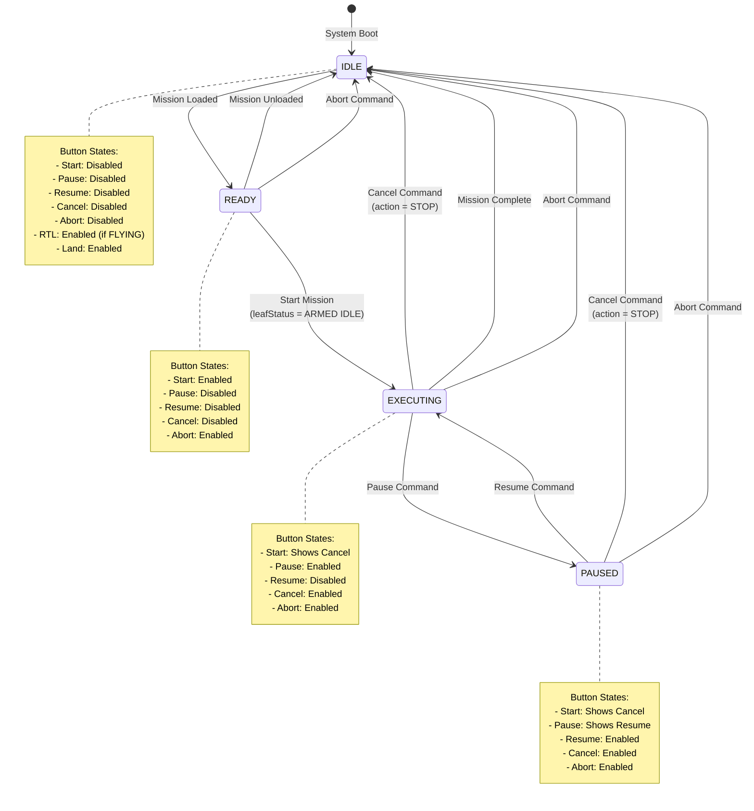
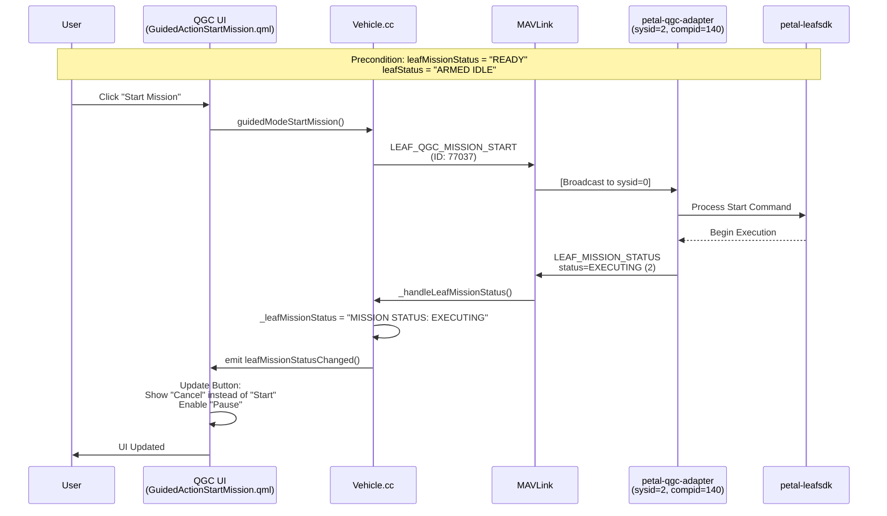
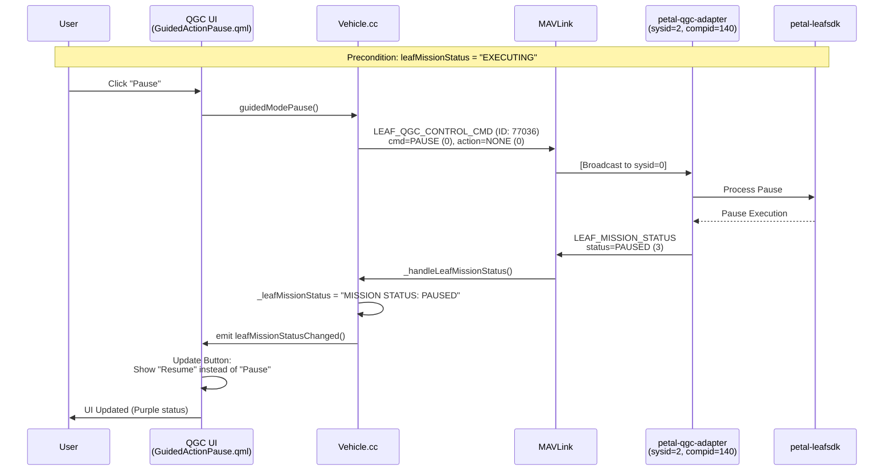
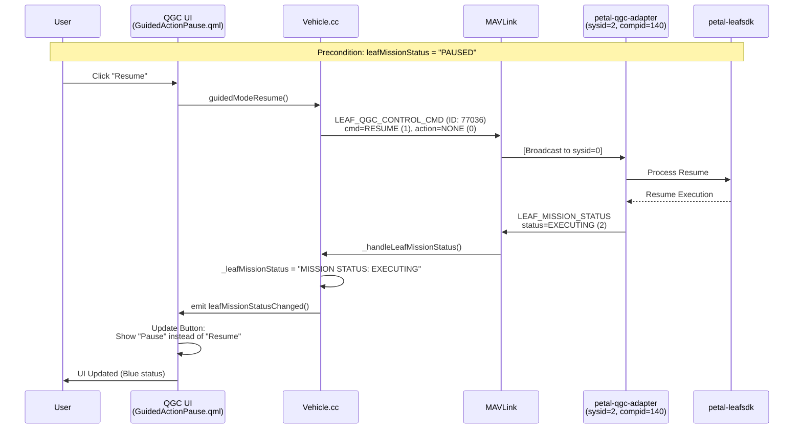
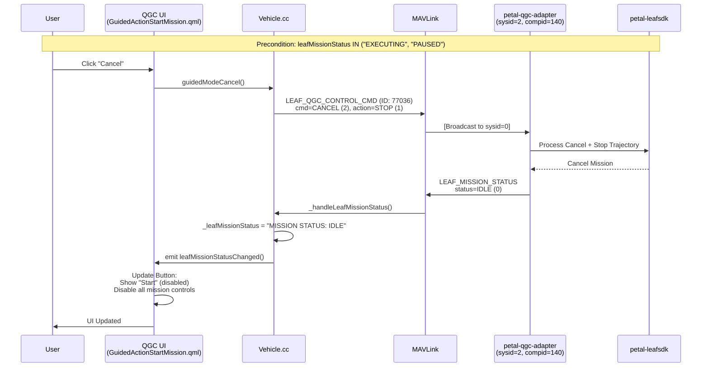
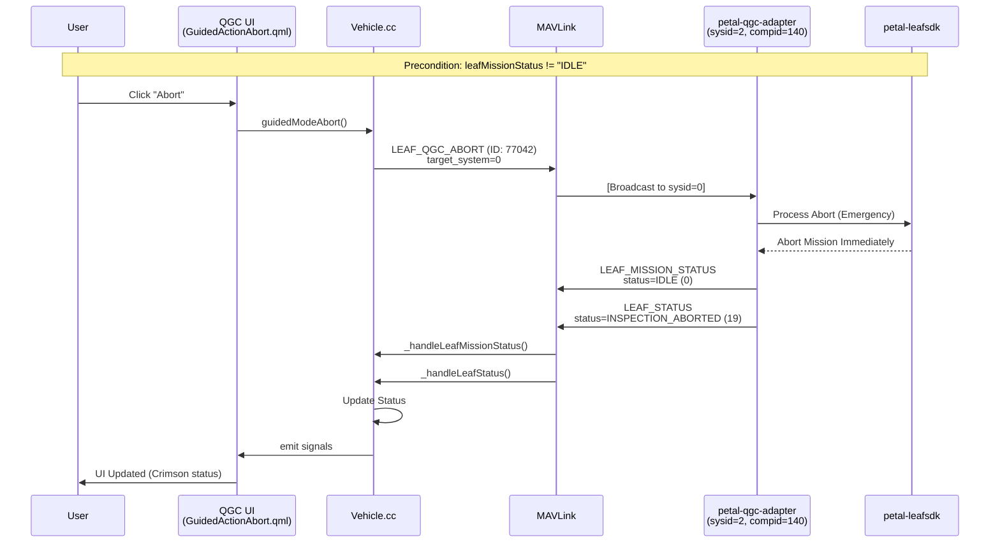
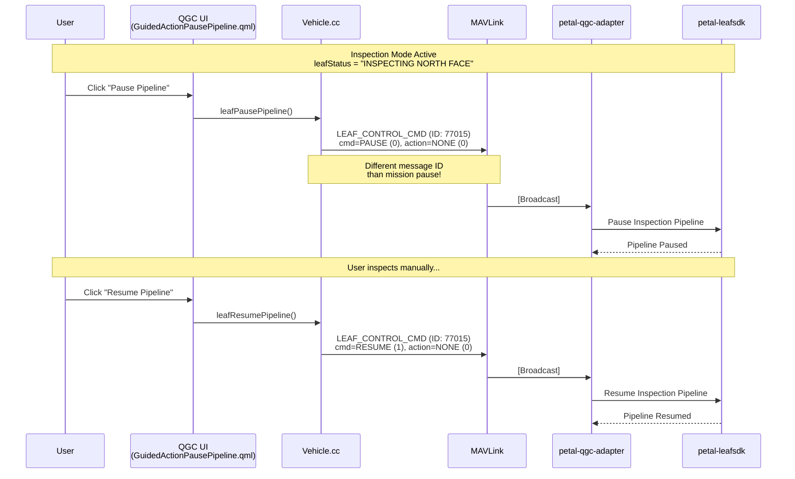
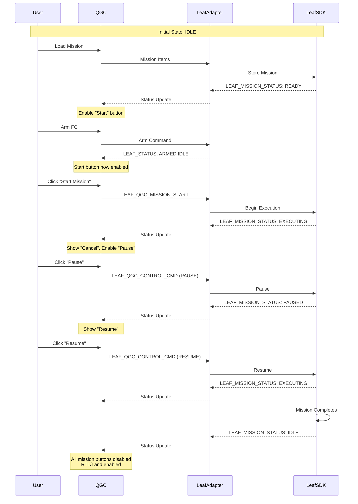

# Command Flow and Mission State Analysis

## Overview

This document provides a comprehensive analysis of command flow and mission state management in the LeafMC system, focusing on the integration between QGroundControl (QGC), petal-qgc-adapter, petal-leafsdk, and LeafFC.

## System Architecture

### Component Identification

| Component | System ID | Component ID | Communication Channel |
|-----------|-----------|--------------|----------------------|
| **LeafFC** (Flight Controller) | 1 | Various | Standard MAVLink |
| **petal-qgc-adapter** (Leaf Manager) | 2 | 140 | Standard MAVLink |
| **petal-leafsdk** | N/A | N/A | Broadcast Channel 0 |
| **QGroundControl** | 255 | 190 | Standard MAVLink |

### Message Routing

QGC treats messages from `sysid=2` (petal-qgc-adapter) as if they originated from the flight controller (`sysid=1`). This is implemented in [Vehicle.cc:L1156-1158](file:///home/yo/LeafMC/src/Vehicle/Vehicle.cc#L1156-L1158):

```cpp
if (message.sysid == Vehicle::DRONE_LEAF_PETAL_APP_MANAGER_SYS_ID) {
    message.sysid = _id; // accepting all type of messages
}
```

## MAVLink Messages

### Control Commands (QGC → System)

#### LEAF_QGC_CONTROL_CMD (ID: 77036)

**Purpose**: Commands sent from QGC to control mission execution

**Message Structure**:
```cpp
typedef struct __mavlink_leaf_qgc_control_cmd_t {
    uint8_t target_system;  // The system to execute the command
    uint8_t cmd;            // The control command (LEAF_CONTROL_COMMAND enum)
    uint8_t action;         // The action modifier (LEAF_CONTROL_COMMAND_ACTION enum)
    char mission_id[64];    // The mission ID to control
} mavlink_leaf_qgc_control_cmd_t;
```

**Command Enum Values** (from `LEAF_CONTROL_COMMAND`):
- `LEAF_CONTROL_PAUSE = 0` - Pause mission execution
- `LEAF_CONTROL_RESUME = 1` - Resume mission execution
- `LEAF_CONTROL_CANCEL = 2` - Cancel mission execution
- `LEAF_CONTROL_ABORT = 3` - Abort mission execution

**Action Enum Values** (from `LEAF_CONTROL_COMMAND_ACTION`):
- `LEAF_CONTROL_COMMAND_ACTION_NONE = 0` - No additional action
- `LEAF_CONTROL_COMMAND_ACTION_STOP = 1` - Stop the current trajectory
- `LEAF_CONTROL_COMMAND_ACTION_RTL = 2` - Return to launch
- `LEAF_CONTROL_COMMAND_ACTION_LIP = 3` - Land in place

**Implementation Location**: [mavlink_msg_leaf_qgc_control_cmd.h](file:///home/yo/LeafMC/libs/mavlink/include/mavlink/v2.0/droneleaf_mav_msgs/mavlink_msg_leaf_qgc_control_cmd.h)

#### LEAF_CONTROL_CMD (ID: 77015)

**Purpose**: Generic control command message (identical structure to LEAF_QGC_CONTROL_CMD)

**Usage**: Used by `leafPausePipeline()` and `leafResumePipeline()` for inspection pipeline control

**Implementation Location**: [mavlink_msg_leaf_control_cmd.h](file:///home/yo/LeafMC/libs/mavlink/include/mavlink/v2.0/droneleaf_mav_msgs/mavlink_msg_leaf_control_cmd.h)

#### LEAF_QGC_MISSION_START (ID: 77037)

**Purpose**: Start mission execution

**Implementation**: [Vehicle::guidedModeStartMission()](file:///home/yo/LeafMC/src/Vehicle/Vehicle.cc#L3198-L3219)

#### LEAF_QGC_ABORT (ID: 77042)

**Purpose**: Abort mission (separate message type from LEAF_QGC_CONTROL_CMD)

**Implementation**: [Vehicle::guidedModeAbort()](file:///home/yo/LeafMC/src/Vehicle/Vehicle.cc#L3095-L3118)

### Status Messages (System → QGC)

#### LEAF_STATUS (ID: 77002)

**Purpose**: Reports the current operational status of the Leaf system

**Key Status Values** (from enum):
- `LEAF_STATUS_READY_TO_LEARN = 0`
- `LEAF_STATUS_LEARNING = 1`
- `LEAF_STATUS_READY_TO_FLY = 2`
- `LEAF_STATUS_TAKING_OFF = 3`
- `LEAF_STATUS_FLYING = 4`
- `LEAF_STATUS_LANDING = 5`
- `LEAF_STATUS_LANDED = 6`
- `LEAF_STATUS_ARMED_IDLE = 7`
- `LEAF_STATUS_ARMED = 8`
- `LEAF_STATUS_DISARMED = 9`
- `LEAF_STATUS_NOT_READY = 10`
- `LEAF_STATUS_INSPECTION_READY = 11`
- `LEAF_STATUS_GOING_TO_NORTH_FACE = 12`
- `LEAF_STATUS_GOING_TO_SOUTH_FACE = 13`
- `LEAF_STATUS_INSPECTING_NORTH_FACE = 14`
- `LEAF_STATUS_INSPECTING_SOUTH_FACE = 15`
- `LEAF_STATUS_INSPECTION_NORTH_FACE_FINISHED = 16`
- `LEAF_STATUS_INSPECTION_SOUTH_FACE_FINISHED = 17`
- `LEAF_STATUS_INSPECTION_FINISHED = 18`
- `LEAF_STATUS_INSPECTION_ABORTED = 19`
- `LEAF_STATUS_MISSION_PAUSED = 20`
- `LEAF_STATUS_RETURNING_TO_BASE = 21`

**Handler**: [Vehicle::_handleLeafStatus()](file:///home/yo/LeafMC/src/Vehicle/Vehicle.cc#L1150-L1200)

**QGC Property**: `Vehicle::leafStatus` (QString)

#### LEAF_MISSION_STATUS (ID: 77035)

**Purpose**: Reports the current mission execution status

**Status Values** (from enum):
- `LEAF_MISSION_STATUS_IDLE = 0` → "MISSION STATUS: IDLE"
- `LEAF_MISSION_STATUS_READY = 1` → "MISSION STATUS: READY"
- `LEAF_MISSION_STATUS_EXECUTING = 2` → "MISSION STATUS: EXECUTING"
- `LEAF_MISSION_STATUS_PAUSED = 3` → "MISSION STATUS: PAUSED"

**Handler**: [Vehicle::_handleLeafMissionStatus()](file:///home/yo/LeafMC/src/Vehicle/Vehicle.cc#L1158-L1166)

**QGC Property**: `Vehicle::leafMissionStatus` (QString)

**UI Color Coding** ([MainStatusIndicator.qml](file:///home/yo/LeafMC/src/ui/toolbar/MainStatusIndicator.qml#L159-L170)):
- `EXECUTING` → Blue
- `PAUSED` → Purple
- `CANCELED` → Crimson
- `ABORTED` → Crimson

#### LEAF_MODE (ID: 77000)

**Purpose**: Reports the current operating mode

**Mode Values** (from enum):
- `LEAF_MODE_RC_Stabilized = 0` → "RC Stabilized"
- `LEAF_MODE_RC_POSITION = 1` → "RC Position"
- `LEAF_MODE_WAYPOINT_MISSION = 2` → "Waypoint Mission"
- `LEAF_MODE_LEARNING_INNER = 3` → "LEARNING INNER"
- `LEAF_MODE_LEARNING_OUTER = 4` → "Learning Outer"
- `LEAF_MODE_LEARNING_FULL = 5` → "Learning Full"
- `LEAF_MODE_INSPECTION = 6` → "INSPECTION"
- `LEAF_MODE_REFINED_TUNING_ONLINE = 7` → "Refined Tuning Online"
- `LEAF_MODE_REFINED_TUNING_OFFLINE = 8` → "Refined Tuning Offline"
- `LEAF_MODE_REFINED_TUNING_OUTER = 9` → "Refined Tuning Outer - Collect Data"
- `LEAF_MODE_MISSION = 10` → "LeafSDK Mission"
- `LEAF_MODE_LEARNING_FULL_DATA_COLLECTION = 11` → "Learning Full Data Collection"

**Handler**: [Vehicle::_handleLeafMode()](file:///home/yo/LeafMC/src/Vehicle/Vehicle.cc#L1150-L1200)

**QGC Property**: `Vehicle::leafMode` (QString)

## UI Button Conditions

All UI buttons have visibility and enable conditions based on combinations of `leafMode`, `leafStatus`, and `leafMissionStatus`.

### Start Mission Button

**File**: [GuidedActionStartMission.qml](file:///home/yo/LeafMC/src/FlightDisplay/GuidedActionStartMission.qml)

**Visibility**: `leafMode.startsWith("LeafSDK Mission")`

**Enable Conditions**:
- **Start Enabled**: `leafMissionStatus == "MISSION STATUS: READY" AND leafStatus == "ARMED IDLE"`
- **Cancel Enabled**: `leafMissionStatus NOT IN ("MISSION STATUS: IDLE", "MISSION STATUS: READY")`

**Button Behavior**: Toggles between "Start Mission" and "Cancel" based on state

### Pause/Resume Button

**File**: [GuidedActionPause.qml](file:///home/yo/LeafMC/src/FlightDisplay/GuidedActionPause.qml)

**Visibility**: `leafMode.startsWith("LeafSDK Mission")`

**Enable Conditions**:
- **Pause Enabled**: `leafMissionStatus == "MISSION STATUS: EXECUTING"`
- **Resume Enabled**: `leafMissionStatus == "MISSION STATUS: PAUSED"`

**Button Behavior**: Toggles between "Pause" and "Resume" based on state

### Cancel Button

**File**: [GuidedActionCancel.qml](file:///home/yo/LeafMC/src/FlightDisplay/GuidedActionCancel.qml)

**Visibility**: `false` (hidden, functionality merged into Start Mission button)

**Disable Conditions**: `leafMissionStatus IN ("MISSION STATUS: IDLE", "MISSION STATUS: READY")`

### Abort Button

**File**: [GuidedActionAbort.qml](file:///home/yo/LeafMC/src/FlightDisplay/GuidedActionAbort.qml)

**Visibility**: `leafMode.startsWith("LeafSDK Mission")`

**Disable Condition**: `leafMissionStatus == "MISSION STATUS: IDLE"`

### RTL (Return to Launch) Button

**File**: [GuidedActionRTL.qml](file:///home/yo/LeafMC/src/FlightDisplay/GuidedActionRTL.qml)

**Visibility**: `leafMode.startsWith("LeafSDK Mission")`

**Enable Condition**: `leafMissionStatus == "MISSION STATUS: IDLE" AND leafStatus.startsWith("FLYING")`

### Land Button

**File**: [GuidedActionLand.qml](file:///home/yo/LeafMC/src/FlightDisplay/GuidedActionLand.qml)

**Visibility**: `true`

**Enable Conditions**:
- `NOT leafStatus.startsWith("ARMED")`
- `NOT leafStatus.startsWith("READY TO FLY")`
- `NOT leafStatus.startsWith("NOT READY")`
- `NOT leafMode IN ("RC Stabilized", "LEARNING INNER", "Refined Tuning Outer - Collect Data")`
- `leafMissionStatus == "MISSION STATUS: IDLE"`

## Command Flow Details

### 1. Start Mission Command

**User Action**: User clicks "Start Mission" button

**UI Condition**: `leafMissionStatus == "READY" AND leafStatus == "ARMED IDLE"`

**QML Trigger**: [GuidedActionStartMission.qml:L37-39](file:///home/yo/LeafMC/src/FlightDisplay/GuidedActionStartMission.qml#L37-L39)

**C++ Implementation**: [Vehicle::guidedModeStartMission()](file:///home/yo/LeafMC/src/Vehicle/Vehicle.cc#L3198-L3219)

**MAVLink Message Sent**:
- Message ID: `77037` (LEAF_QGC_MISSION_START)
- mission_id: `""` (empty)

**Expected Response**: System sends `LEAF_MISSION_STATUS` with status = `LEAF_MISSION_STATUS_EXECUTING`

### 2. Pause Command

**User Action**: User clicks "Pause" button

**UI Condition**: `leafMissionStatus == "EXECUTING"`

**QML Trigger**: [GuidedActionsController.qml:L731](file:///home/yo/LeafMC/src/FlightDisplay/GuidedActionsController.qml#L731)

**C++ Implementation**: [Vehicle::guidedModePause()](file:///home/yo/LeafMC/src/Vehicle/Vehicle.cc#L3120-L3144)

**MAVLink Message Sent**:
- Message ID: `77036` (LEAF_QGC_CONTROL_CMD)
- target_system: `0` (broadcast)
- cmd: `LEAF_CONTROL_PAUSE`
- action: `LEAF_CONTROL_COMMAND_ACTION_NONE`
- mission_id: `""`

**Expected Response**: System sends `LEAF_MISSION_STATUS` with status = `LEAF_MISSION_STATUS_PAUSED`

### 3. Resume Command

**User Action**: User clicks "Resume" button

**UI Condition**: `leafMissionStatus == "PAUSED"`

**QML Trigger**: [GuidedActionsController.qml:L734](file:///home/yo/LeafMC/src/FlightDisplay/GuidedActionsController.qml#L734)

**C++ Implementation**: [Vehicle::guidedModeResume()](file:///home/yo/LeafMC/src/Vehicle/Vehicle.cc#L3146-L3170)

**MAVLink Message Sent**:
- Message ID: `77036` (LEAF_QGC_CONTROL_CMD)
- target_system: `0` (broadcast)
- cmd: `LEAF_CONTROL_RESUME`
- action: `LEAF_CONTROL_COMMAND_ACTION_NONE`
- mission_id: `""`

**Expected Response**: System sends `LEAF_MISSION_STATUS` with status = `LEAF_MISSION_STATUS_EXECUTING`

### 4. Cancel Command

**User Action**: User clicks "Cancel" button (shown as part of Start Mission button)

**UI Condition**: `leafMissionStatus NOT IN ("IDLE", "READY")`

**QML Trigger**: [GuidedActionsController.qml:L737](file:///home/yo/LeafMC/src/FlightDisplay/GuidedActionsController.qml#L737)

**C++ Implementation**: [Vehicle::guidedModeCancel()](file:///home/yo/LeafMC/src/Vehicle/Vehicle.cc#L3172-L3196)

**MAVLink Message Sent**:
- Message ID: `77036` (LEAF_QGC_CONTROL_CMD)
- target_system: `0` (broadcast)
- cmd: `LEAF_CONTROL_CANCEL`
- action: `LEAF_CONTROL_COMMAND_ACTION_STOP` ⚠️
- mission_id: `""`

**Expected Response**: System sends `LEAF_MISSION_STATUS` with status = `LEAF_MISSION_STATUS_IDLE`

### 5. Abort Command

**User Action**: User clicks "Abort" button

**UI Condition**: `leafMissionStatus != "IDLE"`

**QML Trigger**: [GuidedActionsController.qml:L728](file:///home/yo/LeafMC/src/FlightDisplay/GuidedActionsController.qml#L728)

**C++ Implementation**: [Vehicle::guidedModeAbort()](file:///home/yo/LeafMC/src/Vehicle/Vehicle.cc#L3095-L3118)

**MAVLink Message Sent**:
- Message: `LEAF_QGC_ABORT` (ID: 77042)
- target_system: `0` (broadcast)

> ⚠️ **Note**: Abort uses a different MAVLink message type

### 6. Pipeline Pause Command

**User Action**: User clicks "Pause Pipeline" button (inspection mode)

**UI Condition**: `leafMode.length > 0 AND NOT _fcPipelinePaused`

**QML Trigger**: [GuidedActionsController.qml:L857](file:///home/yo/LeafMC/src/FlightDisplay/GuidedActionsController.qml#L857)

**C++ Implementation**: [Vehicle::leafPausePipeline()](file:///home/yo/LeafMC/src/Vehicle/Vehicle.cc#L3394-L3410)

**MAVLink Message Sent**:
- Message ID: `77015` (LEAF_CONTROL_CMD) ⚠️ **Different from mission pause**
- target_system: `0`
- cmd: `LEAF_CONTROL_PAUSE`
- action: `LEAF_CONTROL_COMMAND_ACTION_NONE`
- mission_id: `""`

### 7. Pipeline Resume Command

**User Action**: User clicks "Resume Pipeline" button (inspection mode)

**UI Condition**: `leafMode.length > 0 AND (leafStatus.endsWith("INSPECTING NORTH FACE") OR leafStatus.endsWith("INSPECTING SOUTH FACE"))`

**QML Trigger**: [GuidedActionsController.qml:L862](file:///home/yo/LeafMC/src/FlightDisplay/GuidedActionsController.qml#L862)

**C++ Implementation**: [Vehicle::leafResumePipeline()](file:///home/yo/LeafMC/src/Vehicle/Vehicle.cc#L3412-L3429)

**MAVLink Message Sent**:
- Message ID: `77015` (LEAF_CONTROL_CMD) ⚠️ **Different from mission resume**
- target_system: `0`
- cmd: `LEAF_CONTROL_RESUME`
- action: `LEAF_CONTROL_COMMAND_ACTION_NONE`
- mission_id: `""`

### 8. Joystick Control

**Property**: `Vehicle::joystickEnabled` (bool)

**Storage**: Persisted in QSettings with key `"JoystickEnabled"`

**Activation**: Automatically loaded from settings when joystick is detected

**Deactivation**: Automatically disabled when joystick is disconnected

> ⚠️ **Important**: Joystick control is managed locally within QGC. No MAVLink "activate_joystick" or "deactivate_joystick" commands exist. The property controls whether RC_CHANNELS_OVERRIDE messages are sent.

## Mission State Transitions

### Complete State Diagram



## Sequence Diagrams

### Start Mission Sequence



### Pause Command Sequence



### Resume Command Sequence



### Cancel Command Sequence



### Abort Command Sequence



### Pipeline Pause/Resume Sequence



### Complete Mission Lifecycle



## Key Findings and Discrepancies

### 1. Two Types of Control Messages

**Finding**: The system uses two different message IDs for control commands:
- `LEAF_QGC_CONTROL_CMD` (77036) - Used for mission pause/resume/cancel
- `LEAF_CONTROL_CMD` (77015) - Used for pipeline pause/resume

**Implication**: Mission control and pipeline control are separate systems with different message routing.

### 2. Abort Uses Separate Message

**Finding**: `guidedModeAbort()` uses `LEAF_QGC_ABORT` (77042) instead of `LEAF_QGC_CONTROL_CMD` with `LEAF_CONTROL_ABORT` enum.

**Implication**: Abort is treated as a higher-priority emergency command with different handling.

### 3. Cancel Command Uses STOP Action

**Finding**: Cancel command uses `action = LEAF_CONTROL_COMMAND_ACTION_STOP` while pause/resume use `action = NONE`.

**Implication**: Cancel not only stops mission execution but also stops the current trajectory, providing immediate halt.

### 4. UI Button State Management

**Finding**: The Start Mission button dynamically changes to "Cancel" based on mission status, and the Pause button changes to "Resume".

**Implication**: Single button UI elements reduce clutter while providing context-appropriate actions.

### 5. Broadcast Commands

**Finding**: All commands use `target_system = 0` (broadcast).

**Implication**: The petal-qgc-adapter (sysid=2) filters and processes relevant commands. This allows multiple components to listen for commands.

### 6. Mission ID Field Unused

**Finding**: All command implementations pass empty string `""` for `mission_id`.

**Implication**: Current implementation doesn't support mission-specific control. All commands apply to the active mission.

### 7. Joystick Control is Local

**Finding**: Joystick activation/deactivation is a QGC-local setting with no MAVLink commands.

**Implication**: Joystick state affects RC_CHANNELS_OVERRIDE message transmission, not vehicle state directly.

### 8. State-Dependent UI Visibility

**Finding**: Most mission control buttons are only visible when `leafMode == "LeafSDK Mission"`.

**Implication**: UI adapts to current operating mode, hiding irrelevant controls.

## Related Files

### Core Implementation
- [Vehicle.cc](file:///home/yo/LeafMC/src/Vehicle/Vehicle.cc) - Main vehicle control logic
- [Vehicle.h](file:///home/yo/LeafMC/src/Vehicle/Vehicle.h) - Vehicle class definition

### MAVLink Definitions
- [droneleaf_mav_msgs.h](file:///home/yo/LeafMC/libs/mavlink/include/mavlink/v2.0/droneleaf_mav_msgs/droneleaf_mav_msgs.h) - Enum definitions
- [mavlink_msg_leaf_qgc_control_cmd.h](file:///home/yo/LeafMC/libs/mavlink/include/mavlink/v2.0/droneleaf_mav_msgs/mavlink_msg_leaf_qgc_control_cmd.h)
- [mavlink_msg_leaf_control_cmd.h](file:///home/yo/LeafMC/libs/mavlink/include/mavlink/v2.0/droneleaf_mav_msgs/mavlink_msg_leaf_control_cmd.h)

### UI Components
- [GuidedActionsController.qml](file:///home/yo/LeafMC/src/FlightDisplay/GuidedActionsController.qml) - Action dispatcher
- [GuidedActionStartMission.qml](file:///home/yo/LeafMC/src/FlightDisplay/GuidedActionStartMission.qml) - Start/Cancel button
- [GuidedActionPause.qml](file:///home/yo/LeafMC/src/FlightDisplay/GuidedActionPause.qml) - Pause/Resume button
- [GuidedActionAbort.qml](file:///home/yo/LeafMC/src/FlightDisplay/GuidedActionAbort.qml) - Abort button
- [GuidedActionCancel.qml](file:///home/yo/LeafMC/src/FlightDisplay/GuidedActionCancel.qml) - Cancel button (hidden)
- [GuidedActionRTL.qml](file:///home/yo/LeafMC/src/FlightDisplay/GuidedActionRTL.qml) - RTL button
- [GuidedActionLand.qml](file:///home/yo/LeafMC/src/FlightDisplay/GuidedActionLand.qml) - Land button
- [MainStatusIndicator.qml](file:///home/yo/LeafMC/src/ui/toolbar/MainStatusIndicator.qml) - Status display with color coding

### Joystick
- [Joystick.cc](file:///home/yo/LeafMC/src/Joystick/Joystick.cc) - Joystick input processing
- [JoystickConfigController.cc](file:///home/yo/LeafMC/src/VehicleSetup/JoystickConfigController.cc) - Joystick configuration

### Documentation
- [mission_analysis.md](file:///home/yo/LeafMC/mission_analysis.md) - Mission system documentation
- [mission_comparison_analysis.md](file:///home/yo/LeafMC/mission_comparison_analysis.md) - QGC vs Leaf comparison

## Recommendations

1. **Consolidate Control Messages**: Consider using a single control message type (`LEAF_QGC_CONTROL_CMD`) for both mission and pipeline control to simplify message routing.

2. **Document Abort Message**: Create dedicated documentation for `LEAF_QGC_ABORT` message structure and handling.

3. **Add Mission ID Support**: If multi-mission support is planned, implement mission_id field validation and routing.

4. **State Transition Validation**: Add validation logic to prevent invalid state transitions (e.g., cannot resume from IDLE).

5. **UI Feedback Enhancement**: Consider adding visual feedback for command acknowledgment (e.g., loading spinner while waiting for state change).

6. **Error Handling**: Document error scenarios and recovery procedures when commands fail or timeout.

7. **Testing Coverage**: Create integration tests for all state transitions and command sequences.
