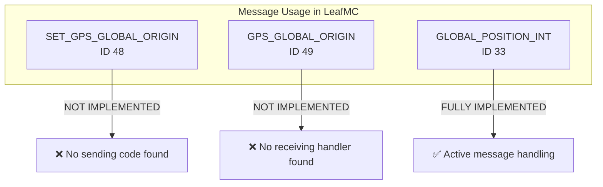
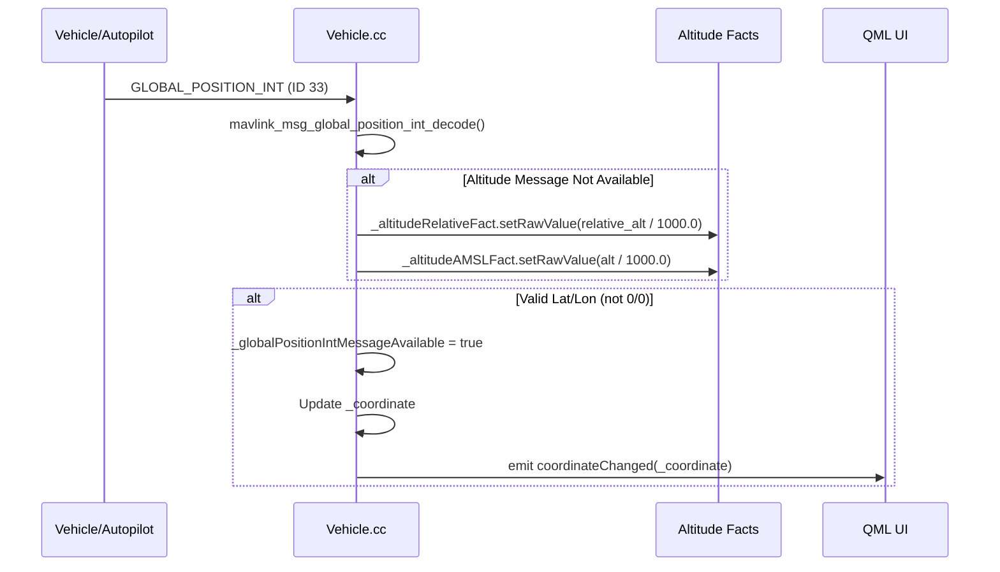
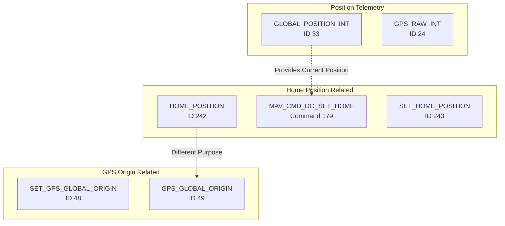
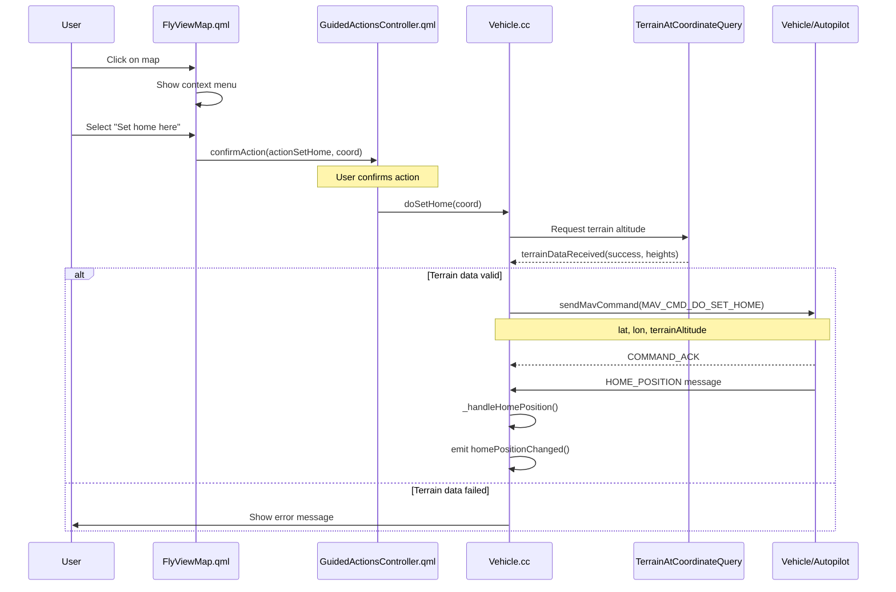
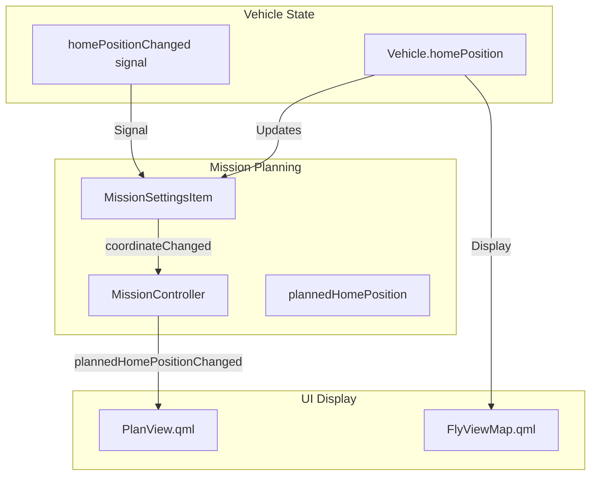
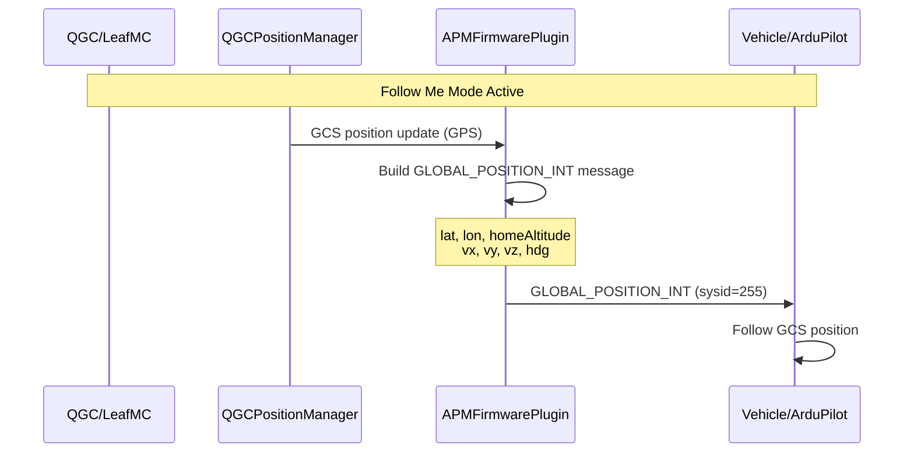
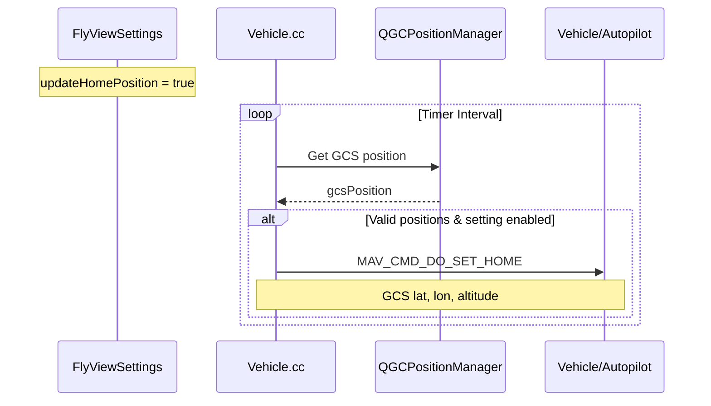
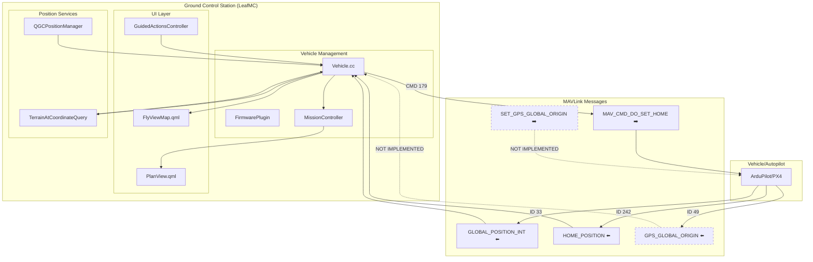
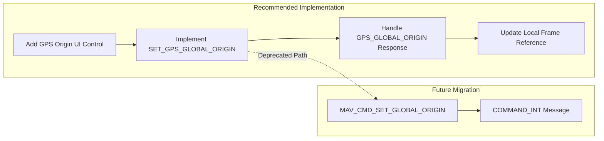

# GPS Global Origin & Position Messages Analysis - LeafMC/QGC

## Overview

This document provides a comprehensive analysis of the MAVLink messages related to GPS global origin and position handling in the LeafMC (QGroundControl fork) project. The focus is on three key messages:

| Message ID | Message Name | Direction | Purpose |
|------------|--------------|-----------|---------|
| 48 | SET_GPS_GLOBAL_ORIGIN | GCS → Vehicle | Sets the GPS coordinates of vehicle local origin (0,0,0) |
| 49 | GPS_GLOBAL_ORIGIN | Vehicle → GCS | Publishes GPS coordinates of vehicle local origin |
| 33 | GLOBAL_POSITION_INT | Vehicle → GCS | Filtered global position (fused GPS + accelerometers) |

---

## Message Definitions

### SET_GPS_GLOBAL_ORIGIN (ID 48)

> **Note**: This message is deprecated since 2025-04 and replaced by `MAV_CMD_SET_GLOBAL_ORIGIN` (Command 611).

**Purpose**: Sets the GPS coordinates of the vehicle's local origin (0,0,0) position. This enables transformation between local coordinate frame and global (GPS) coordinate frame.


**Message Fields**:
| Field | Type | Units | Description |
|-------|------|-------|-------------|
| target_system | uint8_t | - | System ID |
| latitude | int32_t | degE7 | Latitude (WGS84) |
| longitude | int32_t | degE7 | Longitude (WGS84) |
| altitude | int32_t | mm | Altitude (MSL), positive up |
| time_usec | uint64_t | μs | Timestamp (UNIX Epoch or boot time) |

### GPS_GLOBAL_ORIGIN (ID 49)

**Purpose**: Publishes the GPS coordinates of the vehicle local origin. Emitted whenever a new GPS-Local position mapping is requested or set.

**Message Fields**:
| Field | Type | Units | Description |
|-------|------|-------|-------------|
| latitude | int32_t | degE7 | Latitude (WGS84) |
| longitude | int32_t | degE7 | Longitude (WGS84) |
| altitude | int32_t | mm | Altitude (MSL), positive up |
| time_usec | uint64_t | μs | Timestamp |

### GLOBAL_POSITION_INT (ID 33)

**Purpose**: Provides filtered global position data (fused GPS and accelerometers). This is the primary message for vehicle position reporting.

**Message Fields**:
| Field | Type | Units | Description |
|-------|------|-------|-------------|
| time_boot_ms | uint32_t | ms | Timestamp since system boot |
| lat | int32_t | degE7 | Latitude |
| lon | int32_t | degE7 | Longitude |
| alt | int32_t | mm | Altitude (MSL) |
| relative_alt | int32_t | mm | Altitude above home |
| vx | int16_t | cm/s | Ground X Speed (Latitude, positive north) |
| vy | int16_t | cm/s | Ground Y Speed (Longitude, positive east) |
| vz | int16_t | cm/s | Ground Z Speed (Altitude, positive down) |
| hdg | uint16_t | cdeg | Vehicle heading (0.0..359.99°) |

---

## LeafMC Implementation Analysis

### Current Usage Status



### GLOBAL_POSITION_INT Message Flow



**Code Location**: `src/Vehicle/Vehicle.cc` (Lines 1365-1387)

```cpp
void Vehicle::_handleGlobalPositionInt(mavlink_message_t& message)
{
    mavlink_global_position_int_t globalPositionInt;
    mavlink_msg_global_position_int_decode(&message, &globalPositionInt);

    if (!_altitudeMessageAvailable) {
        _altitudeRelativeFact.setRawValue(globalPositionInt.relative_alt / 1000.0);
        _altitudeAMSLFact.setRawValue(globalPositionInt.alt / 1000.0);
    }

    // ArduPilot sends bogus GLOBAL_POSITION_INT messages with lat/lon 0/0
    if (globalPositionInt.lat == 0 && globalPositionInt.lon == 0) {
        return;
    }

    _globalPositionIntMessageAvailable = true;
    QGeoCoordinate newPosition(globalPositionInt.lat / (double)1E7, 
                                globalPositionInt.lon / (double)1E7, 
                                globalPositionInt.alt / 1000.0);
    if (newPosition != _coordinate) {
        _coordinate = newPosition;
        emit coordinateChanged(_coordinate);
    }
}
```

---

## Home Position System

### Related Messages and Commands



### Home Position vs GPS Origin

| Aspect | Home Position | GPS Global Origin |
|--------|---------------|-------------------|
| **Purpose** | Return-to-launch reference point | Local frame origin for indoor/outdoor transition |
| **Changed by** | User action, arming, mission start | Estimator initialization, manual override |
| **Message** | HOME_POSITION (242), SET_HOME_POSITION (243) | GPS_GLOBAL_ORIGIN (49), SET_GPS_GLOBAL_ORIGIN (48) |
| **Command** | MAV_CMD_DO_SET_HOME (179) | MAV_CMD_SET_GLOBAL_ORIGIN (611) [development] |
| **LeafMC Status** | ✅ Fully Implemented | ❌ Not Implemented |

---

## Set Home Flow in LeafMC

### User-Initiated Set Home



### Code Flow

**1. QML Trigger** (`src/FlightDisplay/FlyViewMap.qml`, Line 660):
```qml
QGCButton {
    text: qsTr("Set home here")
    visible: globals.guidedControllerFlyView.showSetHome
    onClicked: {
        popup.close()
        globals.guidedControllerFlyView.confirmAction(
            globals.guidedControllerFlyView.actionSetHome, 
            mapClickCoord
        )
    }
}
```

**2. Action Handler** (`src/FlightDisplay/GuidedActionsController.qml`, Line 788-789):
```qml
case actionSetHome:
    _activeVehicle.doSetHome(actionData)
    break
```

**3. C++ Implementation** (`src/Vehicle/Vehicle.cc`, Line 4869-4920):
```cpp
void Vehicle::doSetHome(const QGeoCoordinate& coord)
{
    if (coord.isValid()) {
        // Setup terrain query for accurate altitude
        _doSetHomeCoordinate = coord;
        _currentDoSetHomeTerrainAtCoordinateQuery = new TerrainAtCoordinateQuery(true);
        connect(_currentDoSetHomeTerrainAtCoordinateQuery, 
                &TerrainAtCoordinateQuery::terrainDataReceived, 
                this, &Vehicle::_doSetHomeTerrainReceived);
        QList<QGeoCoordinate> rgCoord;
        rgCoord.append(coord);
        _currentDoSetHomeTerrainAtCoordinateQuery->requestData(rgCoord);
    }
}

void Vehicle::_doSetHomeTerrainReceived(bool success, QList<double> heights)
{
    if (success) {
        double terrainAltitude = heights[0];
        if (_doSetHomeCoordinate.isValid() && 
            terrainAltitude <= SET_HOME_TERRAIN_ALT_MAX && 
            terrainAltitude >= SET_HOME_TERRAIN_ALT_MIN) {
            sendMavCommand(
                defaultComponentId(),
                MAV_CMD_DO_SET_HOME,
                true,  // show error if fails
                0, 0, 0,
                static_cast<float>(qQNaN()),
                _doSetHomeCoordinate.latitude(),
                _doSetHomeCoordinate.longitude(),
                terrainAltitude
            );
        }
    }
}
```

---

## Mission Planning Integration

### Home Position in Mission Planning



### Mission Home Position Connection

**Code Location**: `src/MissionManager/MissionSettingsItem.cc` (Lines 63-65):
```cpp
connect(_managerVehicle, &Vehicle::homePositionChanged, 
        this, &MissionSettingsItem::_updateHomePosition);
_updateHomePosition(_managerVehicle->homePosition());
```

---

## APM Follow Me Mode (Uses GLOBAL_POSITION_INT)

### GCS Position Broadcasting



**Code Location**: `src/FirmwarePlugin/APM/APMFirmwarePlugin.cc` (Lines 1088-1112):
```cpp
// APM uses GLOBAL_POSITION_INT for Follow Me mode
mavlink_global_position_int_t globalPositionInt;
memset(&globalPositionInt, 0, sizeof(globalPositionInt));

globalPositionInt.time_boot_ms = static_cast<uint32_t>(qgcApp()->msecsSinceBoot());
globalPositionInt.lat = motionReport.lat_int;
globalPositionInt.lon = motionReport.lon_int;
globalPositionInt.alt = static_cast<int32_t>(vehicle->homePosition().altitude() * 1000);
globalPositionInt.relative_alt = static_cast<int32_t>(0);
globalPositionInt.vx = static_cast<int16_t>(motionReport.vxMetersPerSec * 100);
globalPositionInt.vy = static_cast<int16_t>(motionReport.vyMetersPerSec * 100);
globalPositionInt.vz = static_cast<int16_t>(motionReport.vzMetersPerSec * 100);
globalPositionInt.hdg = static_cast<uint16_t>(motionReport.headingDegrees * 100.0);

mavlink_message_t message;
mavlink_msg_global_position_int_encode_chan(..., &message, &globalPositionInt);
vehicle->sendMessageOnLinkThreadSafe(sharedLink.get(), message);
```

---

## Automatic Home Position Update

### GCS-Based Home Update



**Code Location**: `src/Vehicle/Vehicle.cc` (Lines 4696-4712):
```cpp
void Vehicle::_updateHomepoint()
{
    const bool setHomeCmdSupported = firmwarePlugin()->supportedMissionCommands(vehicleClass())
                                        .contains(MAV_CMD_DO_SET_HOME);
    const bool updateHomeActivated = _toolbox->settingsManager()
                                        ->flyViewSettings()->updateHomePosition()->rawValue().toBool();
    
    if(setHomeCmdSupported && updateHomeActivated) {
        QGeoCoordinate gcsPosition = _toolbox->qgcPositionManager()->gcsPosition();
        if (coordinate().isValid() && gcsPosition.isValid()) {
            sendMavCommand(defaultComponentId(),
                           MAV_CMD_DO_SET_HOME, false,
                           0, 0, 0, 0,
                           static_cast<float>(gcsPosition.latitude()),
                           static_cast<float>(gcsPosition.longitude()),
                           static_cast<float>(gcsPosition.altitude()));
        }
    }
}
```

---

## Complete Message Interaction Diagram



---

## Key Findings

### ✅ Implemented Features

1. **GLOBAL_POSITION_INT (ID 33) Reception**
   - Full implementation in `Vehicle::_handleGlobalPositionInt()`
   - Updates vehicle coordinate, altitude facts
   - Handles ArduPilot's bogus 0/0 positions

2. **HOME_POSITION (ID 242) Reception**
   - Full implementation in `Vehicle::_handleHomePosition()`
   - Updates `_homePosition` property
   - Triggers `homePositionChanged` signal

3. **MAV_CMD_DO_SET_HOME (Command 179) Sending**
   - User-initiated via map context menu
   - Terrain-altitude aware implementation
   - Automatic update based on GCS position (optional setting)

### ❌ Not Implemented Features

1. **SET_GPS_GLOBAL_ORIGIN (ID 48) Sending**
   - No code found to send this message
   - Message is deprecated (since 2025-04)

2. **GPS_GLOBAL_ORIGIN (ID 49) Reception**
   - No handler found for this message
   - Not processed in `Vehicle::_mavlinkMessageReceived()`

3. **MAV_CMD_SET_GLOBAL_ORIGIN (Command 611)**
   - New replacement command not implemented
   - Currently in MAVLink development.xml

---

## Recommendations

### For Indoor/Outdoor Transitions

If LeafMC needs to support indoor/outdoor transitions (setting GPS origin for indoor operations):



### Implementation Priority

| Priority | Feature | Reason |
|----------|---------|--------|
| Low | SET_GPS_GLOBAL_ORIGIN | Deprecated, rarely needed |
| Low | GPS_GLOBAL_ORIGIN reception | Only useful for display/debug |
| Medium | MAV_CMD_SET_GLOBAL_ORIGIN | Future-proof for indoor ops |

---

## File References

| File | Purpose |
|------|---------|
| `src/Vehicle/Vehicle.cc` | Main message handling, home position |
| `src/Vehicle/Vehicle.h` | Vehicle class definitions |
| `src/FlightDisplay/FlyViewMap.qml` | Set Home UI trigger |
| `src/FlightDisplay/GuidedActionsController.qml` | Action confirmation logic |
| `src/MissionManager/MissionSettingsItem.cc` | Mission home position |
| `src/MissionManager/MissionController.cc` | Planned home position |
| `src/FirmwarePlugin/APM/APMFirmwarePlugin.cc` | Follow Me GLOBAL_POSITION_INT |
| `libs/mavlink/include/mavlink/v2.0/common/mavlink_msg_*.h` | Message definitions |
| `libs/mavlink/include/mavlink/v2.0/message_definitions/v1.0/common.xml` | MAVLink schema |

---

## Appendix: Message Handler Switch Statement

**Location**: `src/Vehicle/Vehicle.cc` (Lines 766-850)

```cpp
switch (message.msgid) {
    case MAVLINK_MSG_ID_HOME_POSITION:          // ID 242
        _handleHomePosition(message);
        break;
    case MAVLINK_MSG_ID_HEARTBEAT:              // ID 0
        _handleHeartbeat(message);
        break;
    // ... other handlers ...
    case MAVLINK_MSG_ID_GPS_RAW_INT:            // ID 24
        _handleGpsRawInt(message);
        break;
    case MAVLINK_MSG_ID_GLOBAL_POSITION_INT:    // ID 33
        _handleGlobalPositionInt(message);
        break;
    // ... more handlers ...
    
    // NOTE: No handler for:
    // - MAVLINK_MSG_ID_GPS_GLOBAL_ORIGIN (ID 49)
    // - MAVLINK_MSG_ID_SET_GPS_GLOBAL_ORIGIN (ID 48) - outgoing only
}
```

---

*Document generated: December 3, 2025*
*Repository: DroneLeaf/LeafMC*
*Branch: feature/LeafMC_as_mission_planner*
