# LeafMC vs Stock QGC/PX4: Flight Modes and Status Comparison

## Executive Summary

This document provides a comprehensive comparison between:
- **LeafMC** (DroneLeaf fork): Uses custom `LEAF_STATUS` and `LEAF_MODE` enums
- **Stock QGC/PX4**: Uses standard MAVLink `MAV_STATE`, `MAV_MODE_FLAG`, and `PX4_CUSTOM_MODE`

**Date:** November 26, 2025  
**Purpose:** Understanding architectural differences and mapping between systems

---

## Table of Contents

1. [Architectural Overview](#1-architectural-overview)
2. [Mode Comparison](#2-mode-comparison)
3. [Status/State Comparison](#3-statusstate-comparison)
4. [Communication Protocol Differences](#4-communication-protocol-differences)
5. [State Machine Analysis](#5-state-machine-analysis)
6. [Sequence Diagrams](#6-sequence-diagrams)
7. [Mapping Tables](#7-mapping-tables)
8. [Key Differences Summary](#8-key-differences-summary)

---

## 1. Architectural Overview

### 1.1 System Architecture Comparison

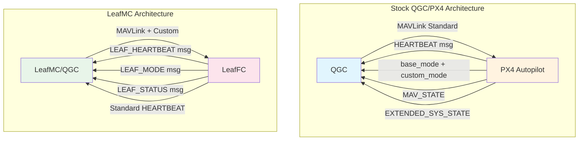

### 1.2 Mode/State Layering

| Layer | Stock PX4/QGC | LeafMC |
|-------|---------------|--------|
| **Protocol** | MAVLink v2.0 standard | MAVLink v2.0 + Custom messages (77000-77043) |
| **Flight Mode** | `custom_mode` in HEARTBEAT (32-bit packed) | `LEAF_MODE` enum via dedicated message |
| **Vehicle State** | `MAV_STATE` enum (8 values) | `LEAF_STATUS` enum (22 values) |
| **Landed State** | `MAV_LANDED_STATE` via EXTENDED_SYS_STATE | Embedded in `LEAF_STATUS` |
| **Armed State** | `MAV_MODE_FLAG_SAFETY_ARMED` bit | `LEAF_STATUS_ARMED` / `LEAF_STATUS_DISARMED` |

---

## 2. Mode Comparison

### 2.1 PX4 Flight Modes (Stock)

PX4 uses a **hierarchical mode system** with main modes and sub-modes packed into a 32-bit custom_mode field:

```cpp
// From px4_custom_mode.h
union px4_custom_mode {
    struct {
        uint16_t reserved;
        uint8_t main_mode;    // PX4_CUSTOM_MAIN_MODE
        uint8_t sub_mode;     // PX4_CUSTOM_SUB_MODE_*
    };
    uint32_t data;
};
```

#### PX4 Main Modes (9 modes)

| ID | Mode Name | Description | Settable |
|----|-----------|-------------|----------|
| 1 | `MANUAL` | Full manual control, no stabilization | Yes |
| 2 | `ALTCTL` | Altitude hold, manual horizontal | Yes |
| 3 | `POSCTL` | Position hold mode | Yes |
| 4 | `AUTO` | Automatic modes (has sub-modes) | Yes |
| 5 | `ACRO` | Acrobatic mode, rate control | Yes |
| 6 | `OFFBOARD` | External computer control | Yes |
| 7 | `STABILIZED` | Attitude stabilization | Yes |
| 8 | `RATTITUDE` | Rate in center, attitude at edges | Yes |
| 9 | `SIMPLE` | Reserved/unused | No |

#### PX4 Auto Sub-Modes (9 sub-modes)

| ID | Sub-Mode Name | Description |
|----|---------------|-------------|
| 1 | `AUTO_READY` | Armed, waiting for takeoff |
| 2 | `AUTO_TAKEOFF` | Automatic takeoff |
| 3 | `AUTO_LOITER` | Hold position (loiter) |
| 4 | `AUTO_MISSION` | Waypoint mission execution |
| 5 | `AUTO_RTL` | Return to launch |
| 6 | `AUTO_LAND` | Automatic landing |
| 7 | `AUTO_RTGS` | Return to groundstation |
| 8 | `AUTO_FOLLOW_TARGET` | Follow moving target |
| 9 | `AUTO_PRECLAND` | Precision landing |

### 2.2 LeafMC Modes (12 modes)

LeafMC uses a **flat mode enum** sent via dedicated `LEAF_MODE` message:

| ID | Mode Name | Description | PX4 Equivalent |
|----|-----------|-------------|----------------|
| 0 | `LEAF_MODE_RC_Stabilized` | Stabilized manual control | `STABILIZED` |
| 1 | `LEAF_MODE_RC_POSITION` | Position hold with RC | `POSCTL` |
| 2 | `LEAF_MODE_WAYPOINT_MISSION` | Waypoint mission | `AUTO_MISSION` |
| 3 | `LEAF_MODE_LEARNING_INNER` | Inner loop learning | *No equivalent* |
| 4 | `LEAF_MODE_LEARNING_OUTER` | Outer loop learning | *No equivalent* |
| 5 | `LEAF_MODE_LEARNING_FULL` | Full system learning | *No equivalent* |
| 6 | `LEAF_MODE_INSPECTION` | **DEPRECATED** | *No equivalent* |
| 7 | `LEAF_MODE_REFINED_TUNING_ONLINE` | Online tuning | *No equivalent* |
| 8 | `LEAF_MODE_REFINED_TUNING_OFFLINE` | Offline tuning | *No equivalent* |
| 9 | `LEAF_MODE_REFINED_TUNING_OUTER` | Outer loop tuning | *No equivalent* |
| 10 | `LEAF_MODE_MISSION` | LeafSDK mission | `OFFBOARD` (similar) |
| 11 | `LEAF_MODE_LEARNING_FULL_DATA_COLLECTION` | Data collection only | *No equivalent* |

### 2.3 Mode Comparison Chart

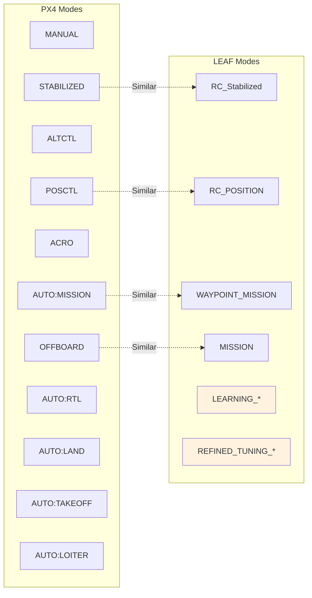

### 2.4 Functional Mode Mapping

| Function | PX4 Mode | LeafMC Mode | Notes |
|----------|----------|-------------|-------|
| **Manual Stabilized** | `STABILIZED` | `RC_Stabilized` | Direct mapping |
| **Position Hold** | `POSCTL` | `RC_POSITION` | Direct mapping |
| **Altitude Hold** | `ALTCTL` | *None* | Not implemented in Leaf |
| **Full Manual/Acro** | `MANUAL`/`ACRO` | *None* | Not exposed in Leaf |
| **Waypoint Mission** | `AUTO:MISSION` | `WAYPOINT_MISSION` | Direct mapping |
| **External Control** | `OFFBOARD` | `MISSION` | Similar concept |
| **Auto Learning** | *None* | `LEARNING_*` | Leaf-specific |
| **Auto Tuning** | *None* | `REFINED_TUNING_*` | Leaf-specific |
| **Return to Launch** | `AUTO:RTL` | *Via LEAF_QGC_RTL cmd* | Command, not mode |

---

## 3. Status/State Comparison

### 3.1 Standard MAVLink States (MAV_STATE)

From `minimal.h` - used by all MAVLink-compliant systems:

| ID | State | Description |
|----|-------|-------------|
| 0 | `MAV_STATE_UNINIT` | Uninitialized, state unknown |
| 1 | `MAV_STATE_BOOT` | System booting |
| 2 | `MAV_STATE_CALIBRATING` | Calibrating, not flight-ready |
| 3 | `MAV_STATE_STANDBY` | Grounded, ready to launch |
| 4 | `MAV_STATE_ACTIVE` | Active, possibly airborne |
| 5 | `MAV_STATE_CRITICAL` | Non-normal flight (failsafe), can navigate |
| 6 | `MAV_STATE_EMERGENCY` | Lost control, mayday |
| 7 | `MAV_STATE_POWEROFF` | Shutting down |
| 8 | `MAV_STATE_FLIGHT_TERMINATION` | Terminating (failsafe/commanded) |

### 3.2 MAV_LANDED_STATE (Extended System State)

| ID | State | Description |
|----|-------|-------------|
| 0 | `UNDEFINED` | Unknown landed state |
| 1 | `ON_GROUND` | MAV is landed |
| 2 | `IN_AIR` | MAV is airborne |
| 3 | `TAKEOFF` | Currently taking off |
| 4 | `LANDING` | Currently landing |

### 3.3 LeafMC Status (LEAF_STATUS)

LeafMC combines flight state, landed state, and operational state into a single enum:

| ID | Status | Category | MAV_STATE Equivalent | MAV_LANDED_STATE Equivalent |
|----|--------|----------|---------------------|----------------------------|
| 0 | `READY_TO_LEARN` | Learning | `STANDBY` | `ON_GROUND` |
| 1 | `LEARNING` | Learning | `ACTIVE` | `IN_AIR` |
| 2 | `READY_TO_FLY` | Pre-flight | `STANDBY` | `ON_GROUND` |
| 3 | `TAKING_OFF` | Transition | `ACTIVE` | `TAKEOFF` |
| 4 | `FLYING` | Flight | `ACTIVE` | `IN_AIR` |
| 5 | `LANDING` | Transition | `ACTIVE` | `LANDING` |
| 6 | `LANDED` | Post-flight | `STANDBY` | `ON_GROUND` |
| 7 | `ARMED_IDLE` | Armed | `STANDBY` | `ON_GROUND` |
| 8 | `ARMED` | Armed | `STANDBY`/`ACTIVE` | `ON_GROUND` |
| 9 | `DISARMED` | Disarmed | `STANDBY` | `ON_GROUND` |
| 10 | `NOT_READY` | Error | `CALIBRATING` | `ON_GROUND` |
| 11-19 | `INSPECTION_*` | **DEPRECATED** | - | - |
| 20 | `MISSION_PAUSED` | Flight | `ACTIVE` | `IN_AIR` |
| 21 | `RETURNING_TO_BASE` | Flight | `ACTIVE` | `IN_AIR` |

### 3.4 Status Comparison Diagram

```mermaid
graph TB
    subgraph "MAV_STATE (8 states)"
        M0[UNINIT]
        M1[BOOT]
        M2[CALIBRATING]
        M3[STANDBY]
        M4[ACTIVE]
        M5[CRITICAL]
        M6[EMERGENCY]
        M7[POWEROFF]
    end
    
    subgraph "LEAF_STATUS (22 states)"
        L0[READY_TO_LEARN]
        L1[LEARNING]
        L2[READY_TO_FLY]
        L3[TAKING_OFF]
        L4[FLYING]
        L5[LANDING]
        L6[LANDED]
        L7[ARMED_IDLE]
        L8[ARMED]
        L9[DISARMED]
        L10[NOT_READY]
        L20[MISSION_PAUSED]
        L21[RETURNING_TO_BASE]
    end
    
    M3 -->|"Maps to"| L0
    M3 -->|"Maps to"| L2
    M3 -->|"Maps to"| L6
    M3 -->|"Maps to"| L7
    M3 -->|"Maps to"| L8
    M3 -->|"Maps to"| L9
    M4 -->|"Maps to"| L1
    M4 -->|"Maps to"| L3
    M4 -->|"Maps to"| L4
    M4 -->|"Maps to"| L5
    M4 -->|"Maps to"| L20
    M4 -->|"Maps to"| L21
    M2 -->|"Maps to"| L10
    
    style L0 fill:#e8f5e9
    style L1 fill:#e8f5e9
    style L2 fill:#e1f5fe
    style L3 fill:#fff3e0
    style L4 fill:#fff3e0
    style L5 fill:#fff3e0
    style L6 fill:#e1f5fe
```

### 3.5 Armed State Comparison

| System | Armed Indicator | Disarmed Indicator |
|--------|-----------------|-------------------|
| **PX4/MAVLink** | `base_mode & MAV_MODE_FLAG_SAFETY_ARMED` (bit flag) | Bit not set |
| **LeafMC** | `LEAF_STATUS_ARMED` or `LEAF_STATUS_ARMED_IDLE` | `LEAF_STATUS_DISARMED` |

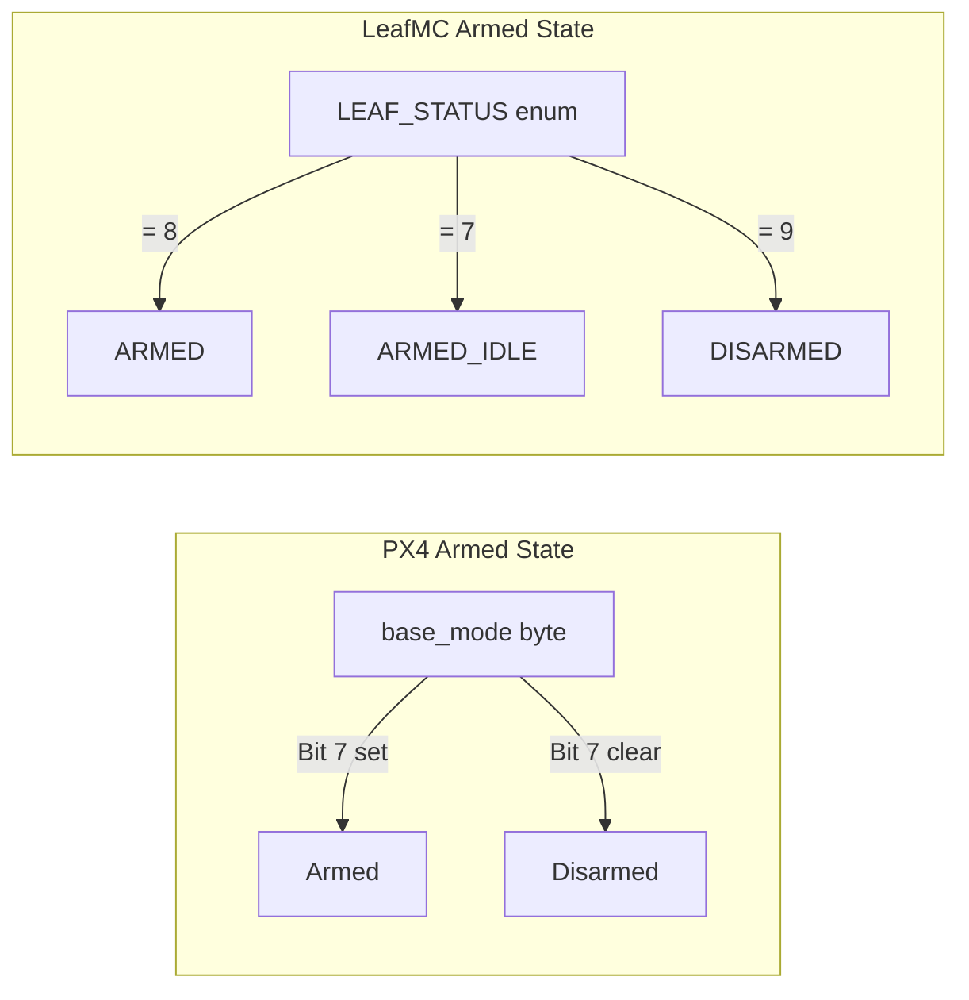

---

## 4. Communication Protocol Differences

### 4.1 Message Flow Comparison

#### PX4/Stock QGC: Mode Change Flow

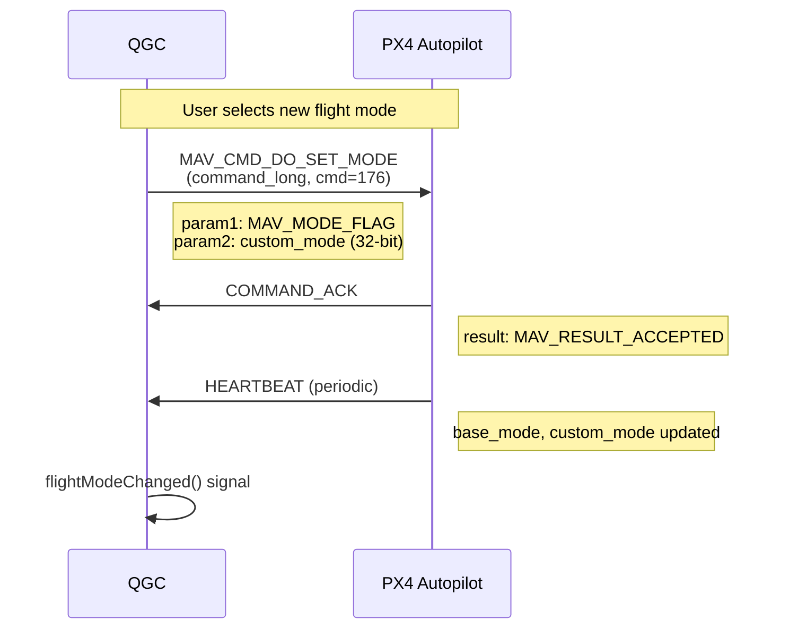

#### LeafMC: Mode Change Flow

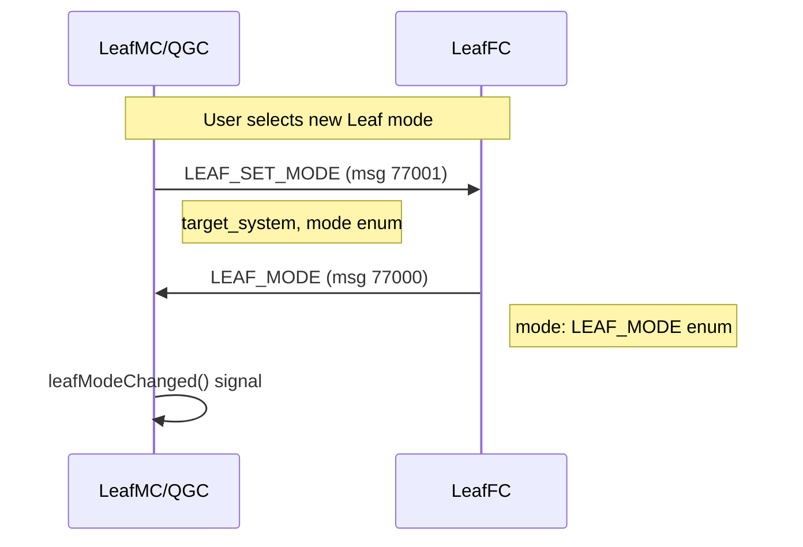

### 4.2 Status Update Comparison

#### PX4: Status via HEARTBEAT + EXTENDED_SYS_STATE

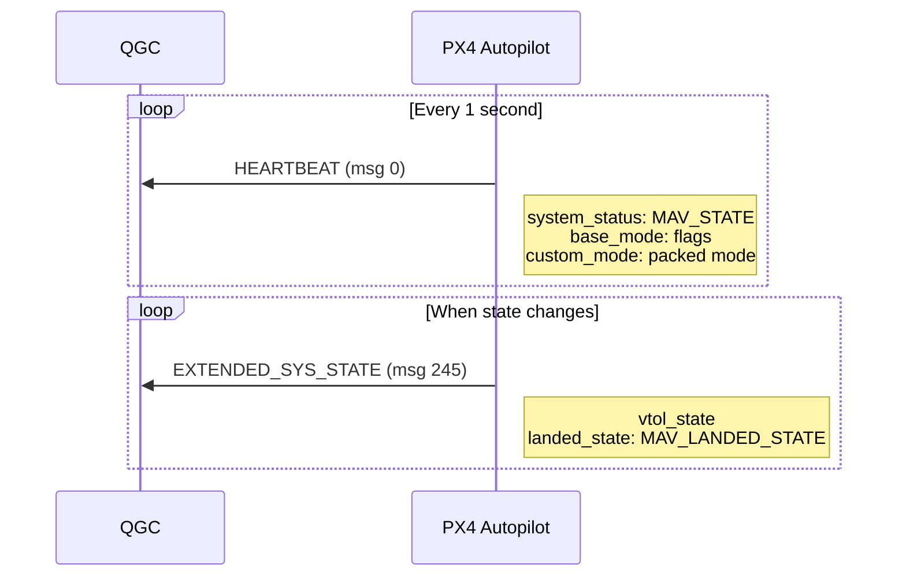

#### LeafMC: Status via LEAF_STATUS + LEAF_HEARTBEAT

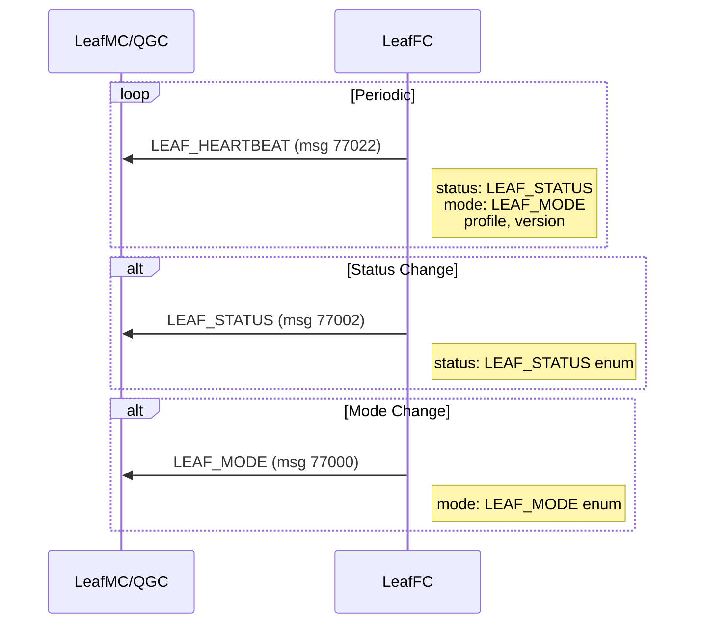

### 4.3 Command Comparison Table

| Action | PX4/MAVLink | LeafMC |
|--------|-------------|--------|
| **Set Mode** | `MAV_CMD_DO_SET_MODE` (cmd 176) | `LEAF_SET_MODE` (msg 77001) |
| **Arm** | `MAV_CMD_COMPONENT_ARM_DISARM` (cmd 400) | `LEAF_DO_ARM` (msg 77003) |
| **Takeoff** | `MAV_CMD_NAV_TAKEOFF` (cmd 22) | `LEAF_DO_TAKEOFF` (msg 77005) |
| **Land** | `MAV_CMD_NAV_LAND` (cmd 21) | `LEAF_DO_LAND` (msg 77006) |
| **RTL** | Mode: `AUTO_RTL` | `LEAF_QGC_RTL` (msg 77038) |
| **Pause Mission** | `MAV_CMD_DO_PAUSE_CONTINUE` | `LEAF_CONTROL_CMD` with `PAUSE` |
| **Resume Mission** | `MAV_CMD_DO_PAUSE_CONTINUE` | `LEAF_CONTROL_CMD` with `RESUME` |

---

## 5. State Machine Analysis

### 5.1 PX4 State Machine

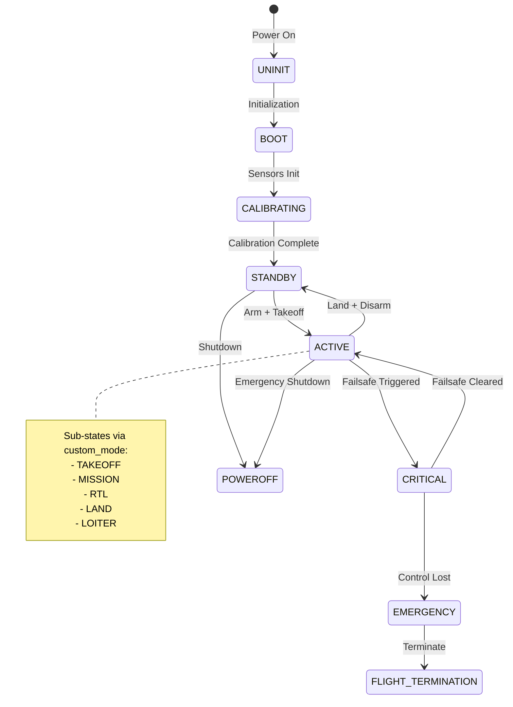

### 5.2 LeafMC State Machine

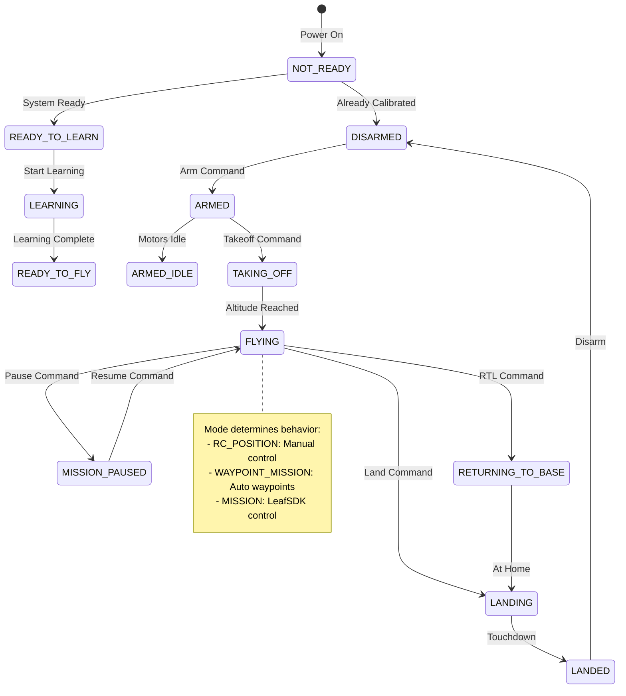

### 5.3 State Transition Comparison

| Transition | PX4 Trigger | LeafMC Trigger |
|------------|-------------|----------------|
| **Boot → Ready** | System init complete | System init complete |
| **Disarm → Arm** | `MAV_CMD_COMPONENT_ARM_DISARM` | `LEAF_DO_ARM` |
| **Ground → Takeoff** | `MAV_CMD_NAV_TAKEOFF` + `AUTO_TAKEOFF` mode | `LEAF_DO_TAKEOFF` |
| **Takeoff → Flying** | Altitude reached (automatic) | Altitude reached (automatic) |
| **Flying → RTL** | Set mode to `AUTO_RTL` | `LEAF_QGC_RTL` command |
| **Flying → Land** | Set mode to `AUTO_LAND` | `LEAF_DO_LAND` |
| **Land → Disarm** | Auto-disarm or command | Auto-disarm or command |

---

## 6. Sequence Diagrams

### 6.1 Complete Flight Sequence: PX4

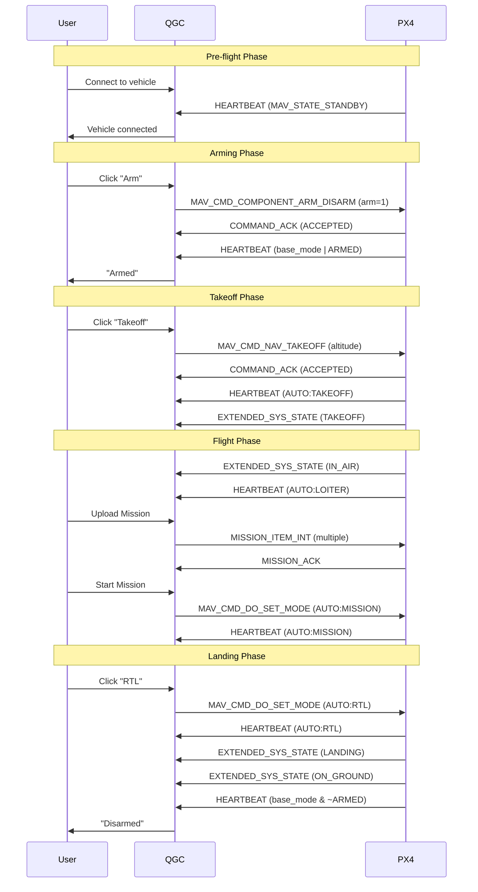

### 6.2 Complete Flight Sequence: LeafMC

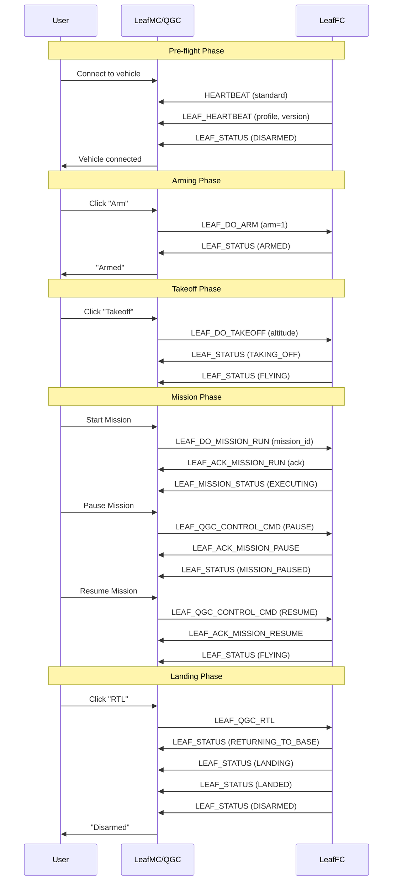

### 6.3 Mode Change Sequence Comparison

#### PX4 Mode Change Flow

```mermaid
sequenceDiagram
    participant App as Application
    participant V as Vehicle.cc
    participant Link as MAVLink
    participant FC as Flight Controller
    
    Note over App,FC: PX4 Mode Change
    App->>V: setFlightMode("Mission")
    V->>V: setFlightModeCustom()
    V->>V: Look up mode in _flightModeInfoList
    V->>Link: MAV_CMD_DO_SET_MODE or SET_MODE
    Link->>FC: MAVLink message
    FC->>Link: HEARTBEAT with new custom_mode
    Link->>V: _handleHeartbeat()
    V->>V: Update _custom_mode
    V->>App: flightModeChanged() signal
```

#### LeafMC Mode Change Flow

```mermaid
sequenceDiagram
    participant App as Application
    participant V as Vehicle.cc
    participant Link as MAVLink
    participant FC as Flight Controller
    
    Note over App,FC: LeafMC Mode Change
    App->>V: setLeafMode("MISSION")
    V->>V: Look up mode in _leafModeNames
    V->>Link: LEAF_SET_MODE (msg 77001)
    Link->>FC: Custom MAVLink message
    FC->>Link: LEAF_MODE (msg 77000)
    Link->>V: _handleLeafMode()
    V->>V: Update _leafMode
    V->>App: leafModeChanged() signal
```

---

## 7. Mapping Tables

### 7.1 Complete Mode Mapping

| Category | PX4/QGC Mode | LeafMC Mode | Bidirectional? |
|----------|--------------|-------------|----------------|
| **Manual Control** | `STABILIZED` | `RC_Stabilized` | ✅ Yes |
| **Position Hold** | `POSCTL` | `RC_POSITION` | ✅ Yes |
| **Altitude Hold** | `ALTCTL` | - | ❌ No Leaf equivalent |
| **Full Manual** | `MANUAL` | - | ❌ No Leaf equivalent |
| **Acrobatic** | `ACRO` | - | ❌ No Leaf equivalent |
| **Waypoint Mission** | `AUTO:MISSION` | `WAYPOINT_MISSION` | ✅ Yes |
| **Hold/Loiter** | `AUTO:LOITER` | - | ❌ No Leaf equivalent |
| **Return to Launch** | `AUTO:RTL` | - | ❌ Command only |
| **Auto Takeoff** | `AUTO:TAKEOFF` | - | ❌ Command only |
| **Auto Land** | `AUTO:LAND` | - | ❌ Command only |
| **External Control** | `OFFBOARD` | `MISSION` | ⚠️ Similar |
| **Learning** | - | `LEARNING_*` | ❌ No PX4 equivalent |
| **Tuning** | - | `REFINED_TUNING_*` | ❌ No PX4 equivalent |

### 7.2 Complete Status Mapping

| PX4 System State | PX4 Landed State | LeafMC Status | Notes |
|------------------|------------------|---------------|-------|
| `STANDBY` | `ON_GROUND` | `DISARMED` | Ready on ground |
| `STANDBY` | `ON_GROUND` | `ARMED` | Armed, motors off |
| `STANDBY` | `ON_GROUND` | `ARMED_IDLE` | Armed, motors idle |
| `STANDBY` | `ON_GROUND` | `READY_TO_FLY` | Pre-flight checks passed |
| `STANDBY` | `ON_GROUND` | `LANDED` | Just landed |
| `ACTIVE` | `TAKEOFF` | `TAKING_OFF` | Climbing after takeoff |
| `ACTIVE` | `IN_AIR` | `FLYING` | Normal flight |
| `ACTIVE` | `IN_AIR` | `MISSION_PAUSED` | Hovering, mission paused |
| `ACTIVE` | `IN_AIR` | `RETURNING_TO_BASE` | RTL in progress |
| `ACTIVE` | `LANDING` | `LANDING` | Descending to land |
| `CALIBRATING` | `ON_GROUND` | `NOT_READY` | System not ready |
| - | - | `LEARNING` | No PX4 equivalent |
| - | - | `READY_TO_LEARN` | No PX4 equivalent |

### 7.3 Message ID Reference

| Function | PX4/MAVLink | LeafMC Custom |
|----------|-------------|---------------|
| **Heartbeat** | `HEARTBEAT` (0) | `LEAF_HEARTBEAT` (77022) |
| **Mode Report** | `HEARTBEAT.custom_mode` | `LEAF_MODE` (77000) |
| **Mode Set** | `MAV_CMD_DO_SET_MODE` (176) | `LEAF_SET_MODE` (77001) |
| **Status Report** | `HEARTBEAT.system_status` | `LEAF_STATUS` (77002) |
| **Arm Command** | `MAV_CMD_COMPONENT_ARM_DISARM` (400) | `LEAF_DO_ARM` (77003) |
| **Takeoff** | `MAV_CMD_NAV_TAKEOFF` (22) | `LEAF_DO_TAKEOFF` (77005) |
| **Land** | `MAV_CMD_NAV_LAND` (21) | `LEAF_DO_LAND` (77006) |
| **RTL** | Mode change to `AUTO_RTL` | `LEAF_QGC_RTL` (77038) |
| **Mission Control** | `MAV_CMD_DO_PAUSE_CONTINUE` | `LEAF_CONTROL_CMD` (77015) |

---

## 8. Key Differences Summary

### 8.1 Architectural Differences

| Aspect | PX4/Stock QGC | LeafMC |
|--------|---------------|--------|
| **Mode Encoding** | 32-bit packed (main+sub) | Simple 8-bit enum |
| **State Encoding** | Separate enums (MAV_STATE + MAV_LANDED_STATE) | Unified enum (LEAF_STATUS) |
| **Protocol** | Standard MAVLink commands | Custom MAVLink messages |
| **Armed State** | Bit flag in base_mode | Dedicated status values |
| **Mode Hierarchy** | Main modes with sub-modes | Flat list |

### 8.2 Capability Differences

| Capability | PX4/Stock QGC | LeafMC |
|------------|---------------|--------|
| **Manual Flight Modes** | 5+ (Manual, Acro, Stabilized, AltCtl, PosCtl) | 2 (RC_Stabilized, RC_Position) |
| **Auto Flight Modes** | 9 (Mission, RTL, Land, Takeoff, etc.) | 2 (Waypoint_Mission, Mission) |
| **Learning/Tuning** | ❌ Not available | ✅ 6 modes |
| **Status Granularity** | Low (8 states) | High (22 states) |
| **Mission Control** | Via mode changes | Dedicated command messages |

### 8.3 Why LeafMC Uses Custom Protocol

1. **Unified Status**: Combines vehicle state, landed state, and operational state into single enum for simpler processing
2. **Learning Integration**: Native support for DroneLeaf's adaptive learning system
3. **Mission Control**: Dedicated messages for pause/resume/abort with acknowledgments
4. **Profile Support**: `LEAF_HEARTBEAT` includes profile and version information
5. **Client Identification**: `LEAF_CLIENT_TAGNAME` for client-specific behavior

### 8.4 Interoperability Notes

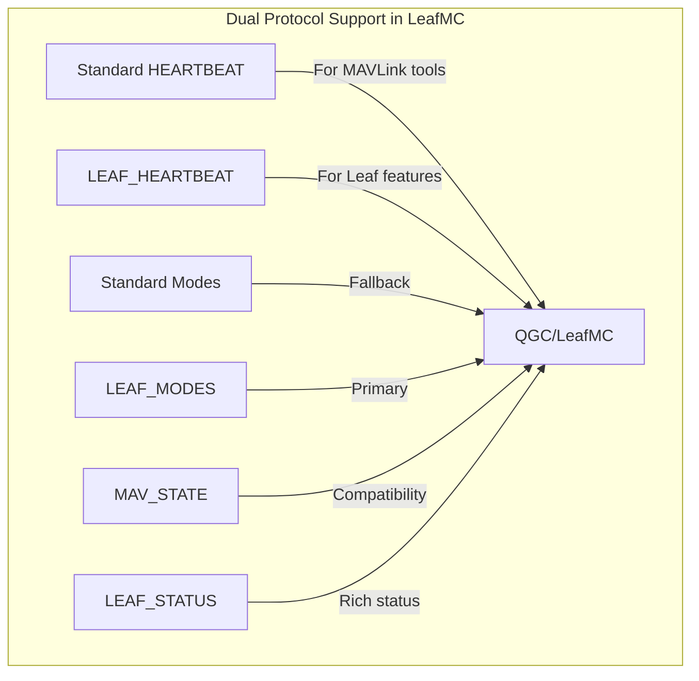

LeafMC maintains **backward compatibility** by:
- Still processing standard `HEARTBEAT` messages
- Sending standard MAVLink messages alongside custom ones
- Allowing fallback to PX4-style mode control when Leaf modes unavailable

---

## Appendix A: Code References

### Vehicle.cc Key Functions

| Function | Purpose | Line |
|----------|---------|------|
| `_handleHeartbeat()` | Process PX4/standard heartbeat | ~1948 |
| `_handleLeafMode()` | Process LEAF_MODE message | ~1175 |
| `_handleLeafStatus()` | Process LEAF_STATUS message | ~1147 |
| `_handleLeafHeartbeat()` | Process LEAF_HEARTBEAT message | ~1197 |
| `setFlightMode()` | Set PX4 flight mode | ~2485 |
| `setLeafMode()` | Set Leaf mode | ~2528 |
| `leafModes()` | Get available Leaf modes | ~2450 |

### File References

| File | Content |
|------|---------|
| `px4_custom_mode.h` | PX4 mode definitions |
| `minimal.h` | MAV_STATE, MAV_MODE_FLAG |
| `common.h` | MAV_LANDED_STATE, extended messages |
| `droneleaf_mav_msgs.xml` | LEAF_* enum and message definitions |

---

## Appendix B: Quick Reference Cards

### PX4 Mode Quick Reference

```
MAIN_MODE:SUB_MODE → Display Name
━━━━━━━━━━━━━━━━━━━━━━━━━━━━━━━━━━
1:0  MANUAL         → "Manual"
7:0  STABILIZED     → "Stabilized"
5:0  ACRO           → "Acro"
2:0  ALTCTL         → "Altitude"
3:0  POSCTL         → "Position"
6:0  OFFBOARD       → "Offboard"
4:4  AUTO:MISSION   → "Mission"
4:5  AUTO:RTL       → "Return"
4:6  AUTO:LAND      → "Land"
4:3  AUTO:LOITER    → "Hold"
4:2  AUTO:TAKEOFF   → "Takeoff"
```

### LeafMC Status Quick Reference

```
ID  STATUS                → UI Text
━━━━━━━━━━━━━━━━━━━━━━━━━━━━━━━━━━━
0   READY_TO_LEARN        → "READY TO LEARN"
1   LEARNING              → "LEARNING"
2   READY_TO_FLY          → "READY TO FLY"
3   TAKING_OFF            → "TAKING OFF"
4   FLYING                → "FLYING"
5   LANDING               → "LANDING"
6   LANDED                → "LANDED"
7   ARMED_IDLE            → "ARMED IDLE"
8   ARMED                 → "ARMED"
9   DISARMED              → "DISARMED"
10  NOT_READY             → "NOT READY"
20  MISSION_PAUSED        → "MISSION PAUSED"
21  RETURNING_TO_BASE     → "RETURNING TO BASE"
```

---

**Document Version:** 1.0  
**Last Updated:** November 26, 2025  
**Author:** GitHub Copilot
