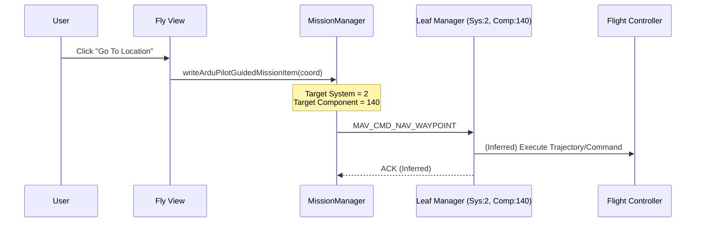

# QGC Mission & DroneLeaf Modification Documentation

## 1. Overview
This documentation details the modifications made to QGroundControl (v4.4.2) to integrate with the **DroneLeaf** system. The core of the modification involves a specialized interaction with a "Leaf Manager" component on the drone, custom vehicle properties for state tracking, and adapted UI flows for mission control.

## 2. Architecture

### 2.1. DroneLeaf System Integration
The DroneLeaf system introduces a dedicated MAVLink component:
- **System ID**: 2 (`DRONE_LEAF_PETAL_APP_MANAGER_SYS_ID`)
- **Component ID**: 140 (`DRONE_LEAF_PETAL_APP_MANAGER_COMPONENT_ID`)

This component acts as a proxy or manager for mission execution and specific drone behaviors (e.g., inspection pipelines).

### 2.2. Vehicle Class Extensions (`Vehicle.h` / `Vehicle.cc`)
The `Vehicle` class has been extended to track DroneLeaf-specific states and expose control methods.

**Key Properties:**
- `leafStatus`: Current status of the Leaf system (e.g., "ARMED IDLE", "INSPECTING NORTH FACE").
- `leafMissionStatus`: Status of the mission engine (e.g., "MISSION STATUS: READY", "MISSION STATUS: IDLE").
- `leafMode`: Current operating mode (e.g., "LeafSDK Mission").
- `leafClientName`, `leafProfile`: Metadata about the connected client/profile.
- `leafMRFT...`: Boolean flags for various "MRFT" (likely Multi-Rotor Flight Test or similar) states.

**Key Methods:**
- `leafArmFC()`, `leafDisarmFC()`: Custom arming commands.
- `leafInspectSlap(int slap)`: Triggers an inspection action.
- `leafPausePipeline()`, `leafResumePipeline()`: Controls for inspection pipelines.

### 2.3. Mission Manager Modifications (`MissionManager.cc`)
The standard `MissionManager` has been modified to redirect **guided mission items** to the Leaf Manager instead of the default vehicle autopilot.

- **Function**: `writeArduPilotGuidedMissionItem`
- **Modification**: The target system and component for `MAV_CMD_NAV_WAYPOINT` are set to the Leaf Manager IDs (2, 140).
- **Impact**: When QGC sends a "Go To" command in guided mode, it is intercepted/handled by the Leaf Manager, allowing it to manage the trajectory or behavior (e.g., for inspections).

## 3. Mission Flows & Logic

### 3.1. Mission Start Logic (`GuidedActionStartMission.qml`)
The "Start Mission" slider/button in the Fly View is conditioned on Leaf states.

```mermaid
graph TD
    A[Start Mission Action] --> B{Check leafMode}
    B -- Starts with "LeafSDK Mission" --> C{Check leafMissionStatus}
    B -- Other --> D[Standard QGC Logic]
    
    C -- "MISSION STATUS: READY" --> E{Check leafStatus}
    C -- Other --> F[Enable Cancel Button]
    
    E -- "ARMED IDLE" --> G[Enable Start Button]
    E -- Other --> H[Disable Start Button]
    
    G --> I[User Slides to Start]
    I --> J[Trigger actionStartMission]
```

### 3.2. Guided Mission Item Execution
When the user clicks on the map to "Go To" a location, the command follows this path:



### 3.3. Inspection Pipeline Control (`GuidedActionResumePipeline.qml`)
A custom action exists to resume inspection pipelines.

```mermaid
graph LR
    A[Monitor State] --> B{leafMode Active?}
    B -- Yes --> C{leafStatus?}
    B -- No --> D[Hide Action]
    
    C -- "INSPECTING NORTH FACE" --> E[Show Resume Button]
    C -- "INSPECTING SOUTH FACE" --> E
    C -- Other --> D
    
    E --> F[User Clicks Resume]
    F --> G[Call leafResumePipeline()]
```

## 4. Key File Modifications

| File | Type | Modification Summary |
|------|------|----------------------|
| `src/Vehicle/Vehicle.h` | Header | Added `DRONE_LEAF_...` constants, `leaf...` properties, and control methods. |
| `src/Vehicle/Vehicle.cc` | Source | Implementation of Leaf properties and MAVLink handling (inferred). |
| `src/MissionManager/MissionManager.cc` | Source | Redirected `writeArduPilotGuidedMissionItem` to Leaf Manager. |
| `src/FlightDisplay/GuidedActionStartMission.qml` | QML | Custom visibility/enable logic based on `leafStatus` and `leafMissionStatus`. |
| `src/FlightDisplay/GuidedActionResumePipeline.qml` | QML | New action for resuming inspection pipelines based on `leafStatus`. |

## 5. State Definitions (Inferred)

Based on the code analysis, the system operates with the following key states:

**`leafStatus` Values:**
- `ARMED IDLE`: System is armed but waiting.
- `INSPECTING NORTH FACE`: Active inspection on north face.
- `INSPECTING SOUTH FACE`: Active inspection on south face.

**`leafMissionStatus` Values:**
- `MISSION STATUS: IDLE`: No mission loaded or active.
- `MISSION STATUS: READY`: Mission loaded and ready to start.

**`leafMode` Values:**
- `LeafSDK Mission`: Indicates the drone is operating under the Leaf SDK control.
