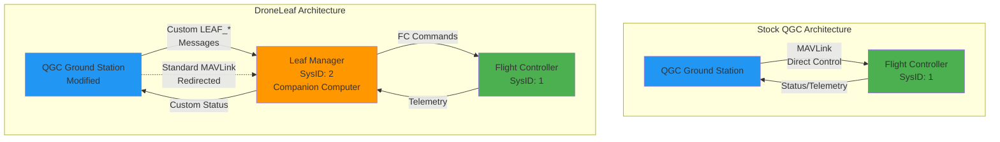
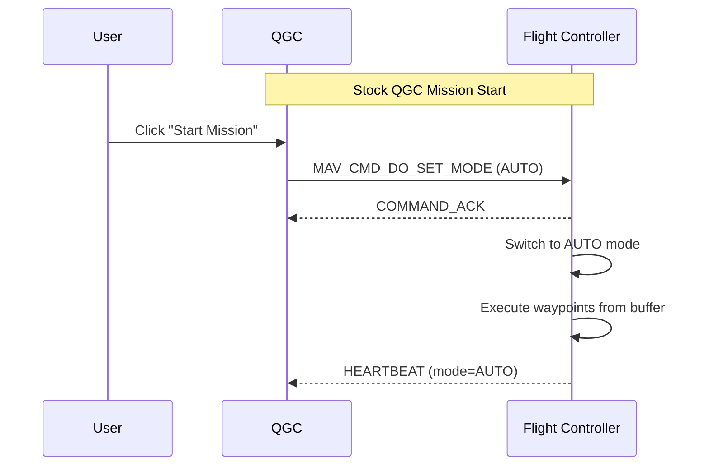
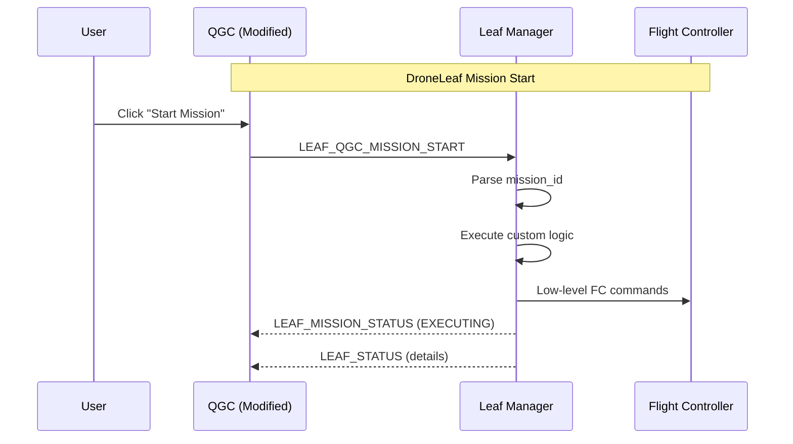
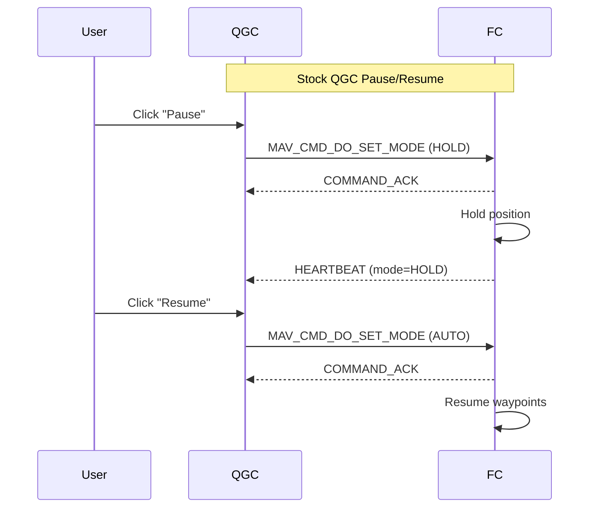
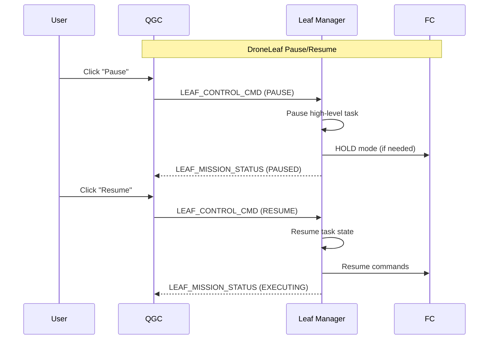
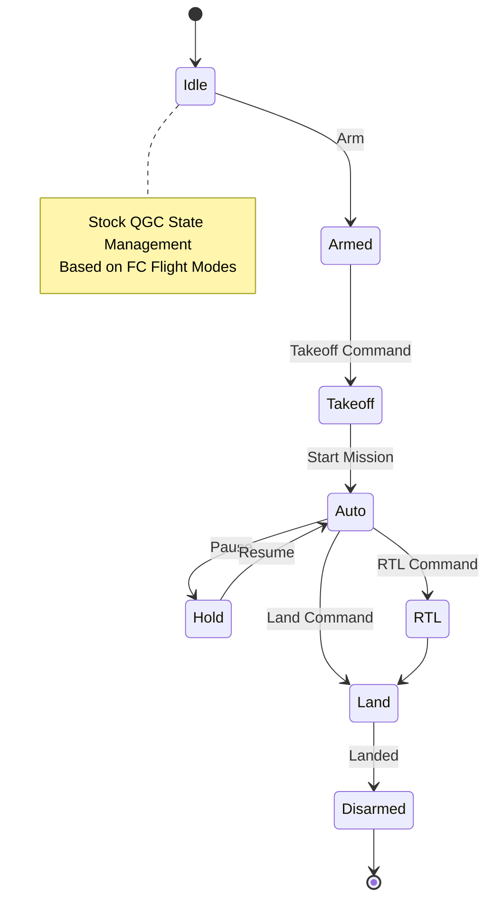
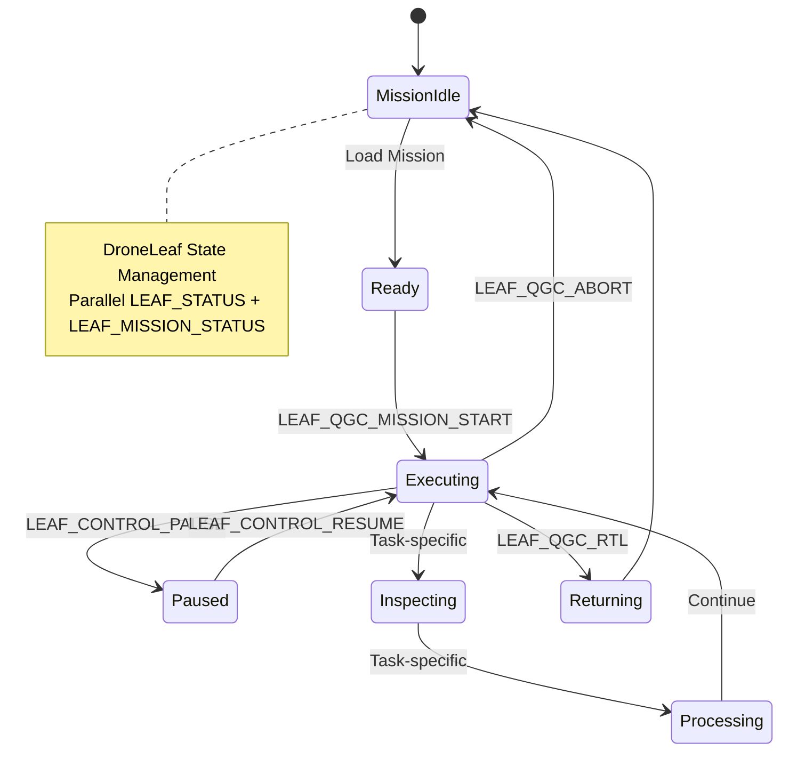
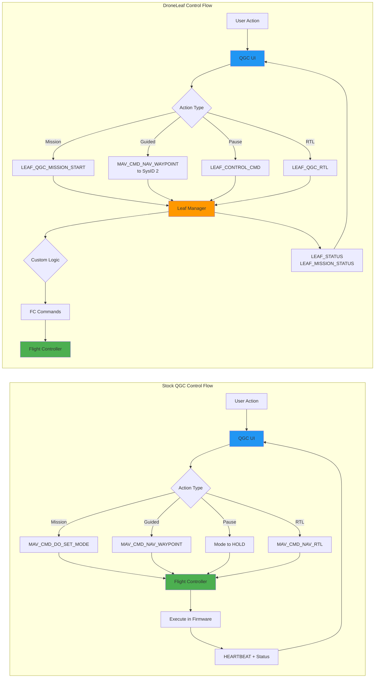

# Mission System Comparative Analysis: Stock QGC vs. DroneLeaf Integration

## Executive Summary
This document provides a deep comparative analysis between the standard QGroundControl (QGC) mission architecture and the custom DroneLeaf integration. The fundamental difference lies in the **Locus of Control**: Stock QGC assumes the Flight Controller (FC) is the primary authority for mission execution, whereas the DroneLeaf integration shifts this authority to an onboard companion computer (the "Leaf Manager"), reducing QGC to a high-level command interface.

## 1. Architectural Paradigms

| Feature | Stock QGC Architecture | DroneLeaf Integration Architecture |
| :--- | :--- | :--- |
| **Primary Target** | Flight Controller (System ID 1) | Leaf Manager (System ID 2) |
| **Communication Model** | **Direct Control:** QGC speaks directly to the Autopilot using standard MAVLink micro-services. | **Proxy / Delegation:** QGC speaks to the Leaf Manager, which acts as a proxy or orchestrator for the Autopilot. |
| **Mission Storage** | Onboard Flight Controller (EEPROM/SD). | Onboard Companion Computer (Leaf Manager Database/Files). |
| **Execution Engine** | Flight Controller Firmware (ArduPilot/PX4). | Leaf Manager Application (Custom Logic). |
| **Coupling** | Tightly coupled to MAVLink Mission Protocol specs. | Loosely coupled via custom "Leaf" messages; standard protocol is emulated/redirected. |

### Analysis
*   **Stock QGC:** Relies on the standardization of MAVLink. It expects the vehicle to behave like a standard PX4/ArduPilot node. This ensures broad compatibility but limits flexibility to what the firmware supports.
*   **DroneLeaf:** Introduces a "Middleman" (Leaf Manager). This allows for arbitrarily complex mission logic (e.g., "Inspect North Face" implies a complex set of waypoints and sensor actions) that the standard FC firmware cannot natively represent.

### Visual Comparison: Architecture



## 2. Mission Lifecycle Comparison


### A. Mission Upload/Download
*   **Stock:** QGC `PlanManager` <-> FC. Uses `MISSION_ITEM_INT`.
*   **DroneLeaf:** QGC `PlanManager` <-> Leaf Manager (SysID 2).
    *   **Code Reference:** [PlanManager.cc:L537](file:///home/yo/LeafMC/src/MissionManager/PlanManager.cc#L537) - Hardcoded target System ID 2 (`DRONE_LEAF_PETAL_APP_MANAGER_SYS_ID`).
    *   **Implication:** The Leaf Manager "pretends" to be a flight controller to satisfy QGC's `PlanManager`. It intercepts the mission file. This allows the Leaf Manager to validate, modify, or store the mission differently before (potentially) feeding it to the FC or executing it directly.

### B. Mission Start
*   **Stock:**
    *   **Mechanism:** `MAV_CMD_DO_SET_MODE` -> `AUTO`.
    *   **Semantics:** "Switch to Auto mode and run whatever is in the waypoint buffer."
*   **DroneLeaf:**
    *   **Mechanism:** `LEAF_QGC_MISSION_START` (Msg ID 77037).
    *   **Code Reference:** [Vehicle.cc:L3212](file:///home/yo/LeafMC/src/Vehicle/Vehicle.cc#L3212) - `guidedModeStartMission` sends `mavlink_msg_leaf_qgc_mission_start`.
    *   **UI Reference:** [GuidedActionStartMission.qml:L17](file:///home/yo/LeafMC/src/FlightDisplay/GuidedActionStartMission.qml#L17) - Button visibility tied to `leafMode.startsWith("LeafSDK Mission")`.
    *   **Semantics:** "Execute the high-level mission logic defined by `mission_id`."
    *   **Difference:** The DroneLeaf start command is explicit and decoupled from the flight mode. It implies a higher level of intent.

### C. Pause / Resume
*   **Stock:**
    *   **Pause:** Mode Switch (`HOLD`) or `DO_PAUSE`.
    *   **Resume:** Mode Switch (`AUTO`) or `DO_CONTINUE`.
    *   **Logic:** Simple linear execution of waypoints.
*   **DroneLeaf:**
    *   **Pause:** `LEAF_CONTROL_CMD` (Msg ID 77015) with `cmd=LEAF_CONTROL_PAUSE`.
        *   **Code Reference:** [Vehicle.cc:L3120](file:///home/yo/LeafMC/src/Vehicle/Vehicle.cc#L3120-L3145) - `guidedModePause` sends `LEAF_CONTROL_CMD`.
        *   **UI Reference:** [GuidedActionPause.qml:L18](file:///home/yo/LeafMC/src/FlightDisplay/GuidedActionPause.qml#L18) - Enabled when `leafMissionStatus == "MISSION STATUS: EXECUTING"`.
    *   **Resume:** `LEAF_CONTROL_CMD` (Msg ID 77015) with `cmd=LEAF_CONTROL_RESUME`.
        *   **Code Reference:** [Vehicle.cc:L3146](file:///home/yo/LeafMC/src/Vehicle/Vehicle.cc#L3146-L3171) - `guidedModeResume` sends `LEAF_CONTROL_CMD`.
        *   **UI Reference:** [GuidedActionPause.qml:L19](file:///home/yo/LeafMC/src/FlightDisplay/GuidedActionPause.qml#L19) - Enabled when `leafMissionStatus == "MISSION STATUS: PAUSED"`.
    *   **Logic:** Can handle complex states (e.g., "Pausing Inspection Pipeline"). The Leaf Manager likely handles the low-level `HOLD` mode on the FC while maintaining its own "Paused" state for the inspection task.

### D. Abort
*   **Stock:**
    *   **Mechanism:** Mode Switch to `LOITER` or `BRAKE`, or project-specific abort sequences.
*   **DroneLeaf:**
    *   **Mechanism:** `LEAF_QGC_ABORT` (Msg ID 77036).
    *   **Code Reference:** [Vehicle.cc:L3097](file:///home/yo/LeafMC/src/Vehicle/Vehicle.cc#L3097-L3118) - `guidedModeAbort` sends `mavlink_msg_leaf_qgc_abort`.
    *   **UI Reference:** [GuidedActionAbort.qml:L17](file:///home/yo/LeafMC/src/FlightDisplay/GuidedActionAbort.qml#L17) - Enabled when `leafMissionStatus != "MISSION STATUS: IDLE"`.
    *   **Semantics:** Immediate abort of the current operation with application-defined behavior.

### E. Return to Launch (RTL)
*   **Stock:**
    *   **Mechanism:** `MAV_CMD_NAV_RETURN_TO_LAUNCH` or Flight Mode Switch to `RTL`.
*   **DroneLeaf:**
    *   **Mechanism:** `LEAF_QGC_RTL` (Msg ID 77035).
    *   **Code Reference:** [Vehicle.cc:L3038](file:///home/yo/LeafMC/src/Vehicle/Vehicle.cc#L3038-L3060) - `guidedModeRTL` sends `mavlink_msg_leaf_qgc_rtl`.
    *   **UI Reference:** [GuidedActionRTL.qml:L18](file:///home/yo/LeafMC/src/FlightDisplay/GuidedActionRTL.qml#L18) - Enabled when `leafMissionStatus == "MISSION STATUS: IDLE" && leafStatus == "FLYING"`.

### F. Land
*   **Stock:**
    *   **Mechanism:** `MAV_CMD_NAV_LAND` or Flight Mode Switch to `LAND`.
*   **DroneLeaf:**
    *   **Mechanism:** `LEAF_DO_LAND` (Msg ID 77034).
    *   **Code Reference:** [Vehicle.cc:L3062](file:///home/yo/LeafMC/src/Vehicle/Vehicle.cc#L3062-L3095) - `guidedModeLand` sends `mavlink_msg_leaf_do_land`.
    *   **UI Reference:** [GuidedActionLand.qml:L19](file:///home/yo/LeafMC/src/FlightDisplay/GuidedActionLand.qml#L19) - Enabled when `leafMissionStatus == "MISSION STATUS: IDLE"`.

### G. Guided Mode (Go To Waypoint)
*   **Stock:**
    *   **Mechanism:** `MAV_CMD_NAV_WAYPOINT` to the Vehicle (SysID 1).
*   **DroneLeaf:**
    *   **Mechanism:** `MAV_CMD_NAV_WAYPOINT` to the Leaf Manager (SysID 2).
    *   **Code Reference:** [MissionManager.cc:L260](file:///home/yo/LeafMC/src/MissionManager/MissionManager.cc#L260-L295) - `writeArduPilotGuidedMissionItem` redirects to Leaf Manager.

### Visual Comparison: Mission Start Flow

````carousel

<!-- slide -->

````

### Visual Comparison: Pause/Resume Flow

````carousel

<!-- slide -->

````

## 3. State Management & Feedback

| Aspect | Stock QGC | DroneLeaf Integration |
| :--- | :--- | :--- |
| **Status Source** | `HEARTBEAT.custom_mode`, `SYS_STATUS`, `EXTENDED_SYS_STATE`. | `LEAF_STATUS`, `LEAF_MISSION_STATUS` (Custom Messages). |
| **Granularity** | Coarse (e.g., "Auto", "Hold", "Land"). | Fine-grained (e.g., "Inspecting", "Processing", "Ready"). |
| **UI Binding** | Standard QGC widgets bind to `_activeVehicle->flightMode()`. | Custom QML widgets bind to `_activeVehicle->leafStatus()`. |
| **Status Handler** | Standard `Vehicle::_mavlinkMessageReceived`. | [Vehicle.cc:L870](file:///home/yo/LeafMC/src/Vehicle/Vehicle.cc#L870) - `_handleLeafStatus` updates `leafStatus`. |
| **Mode Handler** | Standard `Vehicle::_setFlightMode`. | [Vehicle.cc:L2520](file:///home/yo/LeafMC/src/Vehicle/Vehicle.cc#L2520) - `setLeafMode` sends `LEAF_SET_MODE`. |

### Analysis
The DroneLeaf implementation bypasses the limitations of standard MAVLink flight modes. Instead of trying to map "Inspection" to a generic "Auto" mode, it creates a parallel state channel (`LEAF_STATUS`). This provides a richer user experience but requires custom UI elements (modified QGC).

### Visual Comparison: State Management

````carousel

<!-- slide -->

````

## 4. Detailed Feature Matrix

| Feature | Stock QGC | DroneLeaf | Stock Code Reference | DroneLeaf Code Reference |
| :--- | :--- | :--- | :--- | :--- |
| **Mission Upload** | `MISSION_COUNT` to SysID 1 | `MISSION_COUNT` to SysID 2 | `PlanManager::_sendTransactionRequest` | [PlanManager.cc:L537](file:///home/yo/LeafMC/src/MissionManager/PlanManager.cc#L537) |
| **Start Mission** | `MAV_CMD_DO_SET_MODE` (AUTO) | `LEAF_QGC_MISSION_START` | `Vehicle::setFlightMode` | [Vehicle.cc:L3212](file:///home/yo/LeafMC/src/Vehicle/Vehicle.cc#L3212) |
| **Pause** | Mode to `HOLD` | `LEAF_CONTROL_CMD` (PAUSE) | `FirmwarePlugin::pauseVehicle` | [Vehicle.cc:L3120](file:///home/yo/LeafMC/src/Vehicle/Vehicle.cc#L3120) |
| **Resume** | Mode to `AUTO` | `LEAF_CONTROL_CMD` (RESUME) | `FirmwarePlugin::resumeVehicle` | [Vehicle.cc:L3146](file:///home/yo/LeafMC/src/Vehicle/Vehicle.cc#L3146) |
| **Abort** | Mode to `LOITER` | `LEAF_QGC_ABORT` | Varies by firmware | [Vehicle.cc:L3097](file:///home/yo/LeafMC/src/Vehicle/Vehicle.cc#L3097) |
| **RTL** | `MAV_CMD_NAV_RETURN_TO_LAUNCH` | `LEAF_QGC_RTL` | `Vehicle::guidedModeRTL` (old) | [Vehicle.cc:L3038](file:///home/yo/LeafMC/src/Vehicle/Vehicle.cc#L3038) |
| **Land** | `MAV_CMD_NAV_LAND` | `LEAF_DO_LAND` | `FirmwarePlugin::guidedModeLand` | [Vehicle.cc:L3062](file:///home/yo/LeafMC/src/Vehicle/Vehicle.cc#L3062) |
| **Progress** | `MISSION_CURRENT (42)` | `LEAF_STATUS` / `LEAF_MISSION_STATUS` | `Vehicle::_handleMissionCurrent` | [Vehicle.cc:L870](file:///home/yo/LeafMC/src/Vehicle/Vehicle.cc#L870) |

### Visual Comparison: Complete Control Flow



## 5. Pros & Cons

### Stock QGC Methodology
*   **Pros:**
    *   **Universal:** Works with any MAVLink-compliant drone.
    *   **Robust:** Tested by thousands of users; relies on proven firmware logic.
    *   **Maintainable:** Updates to QGC core rarely break basic functionality.
*   **Cons:**
    *   **Limited Semantics:** Cannot easily express complex, non-waypoint tasks (e.g., "Scan QR code then open gate").
    *   **Rigid:** Hard to modify behavior without changing FC firmware.

### DroneLeaf Methodology
*   **Pros:**
    *   **Flexible:** Can implement any logic (computer vision, complex decision trees) on the companion computer.
    *   **Rich Feedback:** Custom messages provide specific context to the operator.
    *   **Abstraction:** Hides low-level FC details from the operator.
*   **Cons:**
    *   **Custom QGC Required:** Requires a forked/modified QGC to understand the custom messages.
    *   **Complexity:** Adds a new layer of failure modes (Leaf Manager crash, Link loss between Leaf Manager and FC).
    *   **Maintenance:** QGC updates must be merged carefully to preserve custom logic.

## 6. Conclusion
The DroneLeaf integration represents a **"Smart Drone" architecture**. It treats the Flight Controller as a commodity actuator and moves the "Brain" to the companion computer.

*   **Stock QGC** sees a mission as a **Path** (Points A -> B -> C).
*   **DroneLeaf** sees a mission as a **Task** (Inspect Asset X).

This fundamental shift necessitates the custom protocol (`LEAF_*` messages) and the redirection of standard planner tools. The implementation is sound for its purpose but trades interoperability for capability.

## 7. Code Reference Summary

### DroneLeaf Key Modifications
All modifications are in the QGC fork at `/home/yo/LeafMC/`:

*   **Mission Protocol Redirection:** [PlanManager.cc:L537](file:///home/yo/LeafMC/src/MissionManager/PlanManager.cc#L537)
*   **Start Mission:** [Vehicle.cc:L3212](file:///home/yo/LeafMC/src/Vehicle/Vehicle.cc#L3212)
*   **Pause:** [Vehicle.cc:L3120](file:///home/yo/LeafMC/src/Vehicle/Vehicle.cc#L3120)
*   **Resume:** [Vehicle.cc:L3146](file:///home/yo/LeafMC/src/Vehicle/Vehicle.cc#L3146)
*   **Abort:** [Vehicle.cc:L3097](file:///home/yo/LeafMC/src/Vehicle/Vehicle.cc#L3097)
*   **RTL:** [Vehicle.cc:L3038](file:///home/yo/LeafMC/src/Vehicle/Vehicle.cc#L3038)
*   **Land:** [Vehicle.cc:L3062](file:///home/yo/LeafMC/src/Vehicle/Vehicle.cc#L3062)
*   **Status Handling:** [Vehicle.cc:L870](file:///home/yo/LeafMC/src/Vehicle/Vehicle.cc#L870)
*   **Mode Setting:** [Vehicle.cc:L2520](file:///home/yo/LeafMC/src/Vehicle/Vehicle.cc#L2520)

### UI Logic
*   **Start Mission Button:** [GuidedActionStartMission.qml:L17](file:///home/yo/LeafMC/src/FlightDisplay/GuidedActionStartMission.qml#L17)
*   **Pause/Resume Button:** [GuidedActionPause.qml:L18-L19](file:///home/yo/LeafMC/src/FlightDisplay/GuidedActionPause.qml#L18-L19)
*   **Abort Button:** [GuidedActionAbort.qml:L17](file:///home/yo/LeafMC/src/FlightDisplay/GuidedActionAbort.qml#L17)
*   **RTL Button:** [GuidedActionRTL.qml:L18](file:///home/yo/LeafMC/src/FlightDisplay/GuidedActionRTL.qml#L18)
*   **Land Button:** [GuidedActionLand.qml:L19](file:///home/yo/LeafMC/src/FlightDisplay/GuidedActionLand.qml#L19)
