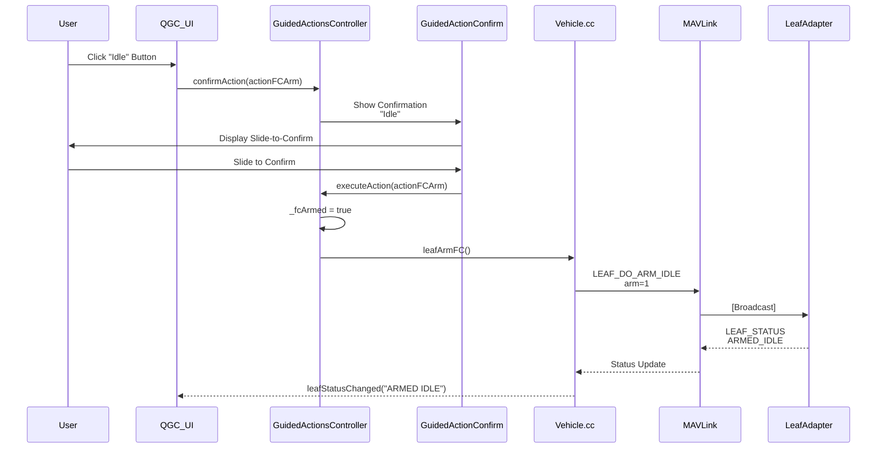
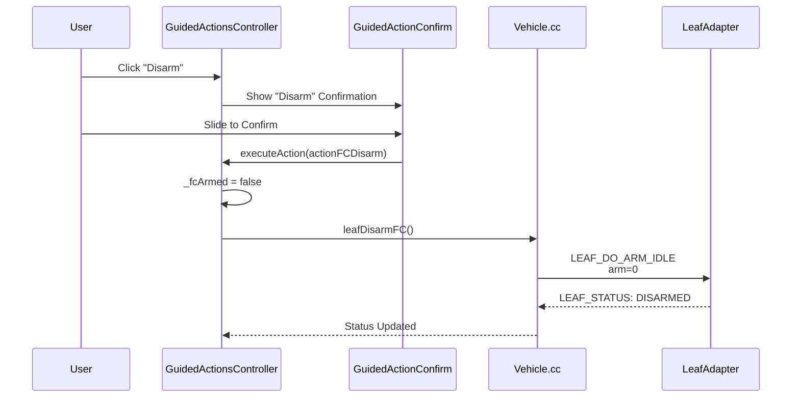
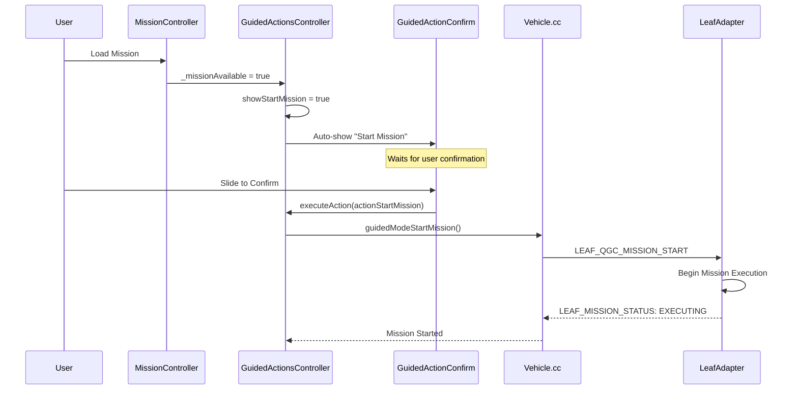

# QGC Confirmation Actions Analysis

## Overview

This document provides a comprehensive analysis of all mission-related confirmation actions in QGroundControl (QGC) for the LeafMC system. Each action requires user confirmation via a slide-to-confirm dialog before execution.

## Confirmation Dialog System

### Dialog Component

**File**: [GuidedActionConfirm.qml](file:///home/yo/LeafMC/src/FlightDisplay/GuidedActionConfirm.qml)

**Confirmation Mechanism**:
- **Mobile**: "Slide to confirm"
- **Desktop**: "Slide or hold spacebar"

**Dialog Elements**:
- Message text explaining the action
- Optional checkbox for additional options
- Slide-to-confirm control
- Cancel button (X icon)

**Visibility Control**:
- Immediate display for critical actions
- 1-second delay for state-dependent actions (to allow state changes to propagate)
- Auto-hide when trigger conditions become false

### Action Controller

**File**: [GuidedActionsController.qml](file:///home/yo/LeafMC/src/FlightDisplay/GuidedActionsController.qml)

**Total Actions**: 44 distinct action codes

## Mission-Related Confirmation Actions

### 1. Idle (Arm FC)

**Action Code**: `actionFCArm` (35)

**Title**: "Idle"

**Message**: "Idle"

**Trigger Sequence**:
1. User clicks "Idle" button in UI
2. OR: User requests arm via `mainWindow.onLeafArmVehicleRequested()`
3. `confirmAction(actionFCArm)` is called
4. Confirmation dialog appears immediately (`hideTrigger = true`)

**Preconditions**:
- None (always available)

**Execution** ([GuidedActionsController.qml:L814-817](file:///home/yo/LeafMC/src/FlightDisplay/GuidedActionsController.qml#L814-L817)):
```qml
case actionFCArm:
    _fcArmed = true
    _activeVehicle.leafArmFC()
    break
```

**C++ Implementation** ([Vehicle.cc:L3245-3261](file:///home/yo/LeafMC/src/Vehicle/Vehicle.cc#L3245-L3261)):
```cpp
void Vehicle::leafArmFC() {
    mavlink_message_t arm_msg;
    mavlink_msg_leaf_do_arm_idle_pack_chan(
        _mavlink->getSystemId(),
        _mavlink->getComponentId(),
        sharedLink->mavlinkChannel(),
        &arm_msg,
        0,  // target_system
        1); // arm = 1 (IDLE state)
    sendMessageOnLinkThreadSafe(sharedLink.get(), arm_msg);
}
```

**MAVLink Message**: `LEAF_DO_ARM_IDLE` (ID: 77017)
- target_system: `0` (broadcast)
- arm: `1` (enter IDLE/ARMED state)

**Post-Action State**:
- `_fcArmed = true`
- `leafStatus` → "ARMED IDLE"
- Vehicle enters armed idle state, ready for mission start

**Sequence Diagram**:


---

### 2. Disarm

**Action Code**: `actionFCDisarm` (36)

**Title**: "Disarm"

**Message**: "Disarm"

**Trigger Sequence**:
1. User clicks "Disarm" button
2. OR: User requests disarm via `mainWindow.onLeafDisarmVehicleRequested()`
3. `confirmAction(actionFCDisarm)` is called
4. Confirmation dialog appears immediately

**Preconditions**:
- Vehicle is armed (`_fcArmed = true`)
- Vehicle is not flying

**Execution** ([GuidedActionsController.qml:L818-821](file:///home/yo/LeafMC/src/FlightDisplay/GuidedActionsController.qml#L818-L821)):
```qml
case actionFCDisarm:
    _fcArmed = false
    _activeVehicle.leafDisarmFC()
    break
```

**C++ Implementation** ([Vehicle.cc:L3262-3289](file:///home/yo/LeafMC/src/Vehicle/Vehicle.cc#L3262-L3289)):
```cpp
void Vehicle::leafDisarmFC() {
    mavlink_message_t arm_msg;
    mavlink_msg_leaf_do_arm_idle_pack_chan(
        _mavlink->getSystemId(),
        _mavlink->getComponentId(),
        sharedLink->mavlinkChannel(),
        &arm_msg,
        0,  // target_system
        0); // arm = 0 (disarm)
    sendMessageOnLinkThreadSafe(sharedLink.get(), arm_msg);
}
```

**MAVLink Message**: `LEAF_DO_ARM_IDLE` (ID: 77017)
- target_system: `0` (broadcast)
- arm: `0` (disarm)

**Post-Action State**:
- `_fcArmed = false`
- `leafStatus` → "DISARMED"
- Vehicle is disarmed and safe

**Sequence Diagram**:


---

### 3. Start Mission

**Action Code**: `actionStartMission` (12)

**Title**: "Start Mission"

**Message**: "Start the current mission."

**Trigger Sequence**:
1. Mission becomes available and vehicle is not flying
2. `showStartMission` property becomes `true`
3. Auto-triggers: `confirmAction(actionStartMission)` ([GuidedActionsController.qml:L326](file:///home/yo/LeafMC/src/FlightDisplay/GuidedActionsController.qml#L326))
4. Confirmation dialog appears immediately

**Preconditions** ([GuidedActionsController.qml:L193](file:///home/yo/LeafMC/src/FlightDisplay/GuidedActionsController.qml#L193)):
```qml
showStartMission: _guidedActionsEnabled && _missionAvailable && 
                  !_missionActive && !_vehicleFlying && _canStartMission
```

Where:
- `_guidedActionsEnabled`: Guided actions are enabled
- `_missionAvailable`: Mission items are loaded (`missionController.containsItems`)
- `!_missionActive`: Mission is not currently running
- `!_vehicleFlying`: Vehicle is on the ground
- `_canStartMission`: Checklist passed and health checks allow mission start

**Execution** ([GuidedActionsController.qml:L743-745](file:///home/yo/LeafMC/src/FlightDisplay/GuidedActionsController.qml#L743-L745)):
```qml
case actionStartMission:
    _activeVehicle.guidedModeStartMission()
    break
```

**C++ Implementation** ([Vehicle.cc:L3198-3219](file:///home/yo/LeafMC/src/Vehicle/Vehicle.cc#L3198-L3219)):
```cpp
void Vehicle::guidedModeStartMission() {
    mavlink_message_t start_msg;
    mavlink_msg_leaf_qgc_mission_start_pack_chan(
        _mavlink->getSystemId(),
        _mavlink->getComponentId(),
        sharedLink->mavlinkChannel(),
        &start_msg,
        "");  // mission_id (empty)
    sendMessageOnLinkThreadSafe(sharedLink.get(), start_msg);
}
```

**MAVLink Message**: `LEAF_QGC_MISSION_START` (ID: 77037)
- mission_id: `""` (empty string - applies to active mission)

**Post-Action State**:
- `leafMissionStatus` → "MISSION STATUS: EXECUTING"
- `leafStatus` → "FLYING" or mission-specific status
- Mission execution begins

**Sequence Diagram**:


---

### 4. Continue Mission

**Action Code**: `actionContinueMission` (13)

**Title**: "Continue Mission"

**Message**: "Continue the mission from the current waypoint."

**Trigger Sequence**:
1. Vehicle is armed and flying with mission available
2. Current waypoint is not the last waypoint
3. `showContinueMission` becomes `true`
4. Auto-triggers with 1-second delay: `confirmAction(actionContinueMission)`

**Preconditions** ([GuidedActionsController.qml:L194](file:///home/yo/LeafMC/src/FlightDisplay/GuidedActionsController.qml#L194)):
```qml
showContinueMission: _guidedActionsEnabled && _missionAvailable && 
                     !_missionActive && _vehicleArmed && _vehicleFlying && 
                     (_currentMissionIndex < _missionItemCount - 1)
```

**Execution** ([GuidedActionsController.qml:L746-748](file:///home/yo/LeafMC/src/FlightDisplay/GuidedActionsController.qml#L746-L748)):
```qml
case actionContinueMission:
    _activeVehicle.startMission()
    break
```

**Post-Action State**:
- Mission resumes from current waypoint
- `_missionActive = true`

---

### 5. Resume Mission

**Action Code**: `actionResumeMission` (14)

**Title**: N/A (handled in mission end dialog)

**Message**: N/A

**Trigger Sequence**:
1. Vehicle was flying and landed
2. Mission has a valid resume point
3. Handled separately in mission end dialog

**Preconditions** ([GuidedActionsController.qml:L209](file:///home/yo/LeafMC/src/FlightDisplay/GuidedActionsController.qml#L209)):
```qml
showResumeMission: _activeVehicle && !_vehicleArmed && _vehicleWasFlying && 
                   _missionAvailable && _resumeMissionIndex > 0 && 
                   (_resumeMissionIndex < _missionItemCount - 2)
```

**Execution** ([GuidedActionsController.qml:L739-742](file:///home/yo/LeafMC/src/FlightDisplay/GuidedActionsController.qml#L739-L742)):
```qml
case actionResumeMission:
case actionResumeMissionUploadFail:
    missionController.resumeMission(missionController.resumeMissionIndex)
    break
```

---

### 6. Pause

**Action Code**: `actionPause` (17)

**Title**: "Pause"

**Message**: "Pause the current running mission."

**Trigger Sequence**:
1. User clicks "Pause" button
2. `confirmAction(actionPause)` is called
3. Confirmation dialog appears immediately

**Preconditions** ([GuidedActionsController.qml:L195](file:///home/yo/LeafMC/src/FlightDisplay/GuidedActionsController.qml#L195)):
```qml
showPause: _guidedActionsEnabled && _vehicleArmed && 
           _activeVehicle.pauseVehicleSupported && _vehicleFlying && 
           !_vehiclePaused && !_fixedWingOnApproach
```

**Execution** ([GuidedActionsController.qml:L730-732](file:///home/yo/LeafMC/src/FlightDisplay/GuidedActionsController.qml#L730-L732)):
```qml
case actionPause:
    _activeVehicle.guidedModePause()
    break
```

**C++ Implementation**: See [command_flow_analysis.md - Pause Command](file:///home/yo/LeafMC/command_flow_analysis.md)

**MAVLink Message**: `LEAF_QGC_CONTROL_CMD` (ID: 77036)
- cmd: `LEAF_CONTROL_PAUSE`
- action: `LEAF_CONTROL_COMMAND_ACTION_NONE`

**Post-Action State**:
- `leafMissionStatus` → "MISSION STATUS: PAUSED"
- Vehicle holds position

---

### 7. Resume

**Action Code**: `actionResume` (43)

**Title**: "Resume"

**Message**: "Resume the current paused mission."

**Trigger Sequence**:
1. User clicks "Resume" button (shown when paused)
2. `confirmAction(actionResume)` is called
3. Confirmation dialog appears immediately

**Preconditions**:
- `leafMissionStatus == "MISSION STATUS: PAUSED"`

**Execution** ([GuidedActionsController.qml:L733-735](file:///home/yo/LeafMC/src/FlightDisplay/GuidedActionsController.qml#L733-L735)):
```qml
case actionResume:
    _activeVehicle.guidedModeResume()
    break
```

**MAVLink Message**: `LEAF_QGC_CONTROL_CMD` (ID: 77036)
- cmd: `LEAF_CONTROL_RESUME`
- action: `LEAF_CONTROL_COMMAND_ACTION_NONE`

**Post-Action State**:
- `leafMissionStatus` → "MISSION STATUS: EXECUTING"
- Mission execution resumes

---

### 8. Cancel

**Action Code**: `actionCancel` (44)

**Title**: "Cancel"

**Message**: "Cancel the current running mission."

**Trigger Sequence**:
1. User clicks "Cancel" button
2. `confirmAction(actionCancel)` is called
3. Confirmation dialog appears immediately

**Preconditions**:
- Mission is executing or paused
- `leafMissionStatus NOT IN ("IDLE", "READY")`

**Execution** ([GuidedActionsController.qml:L736-738](file:///home/yo/LeafMC/src/FlightDisplay/GuidedActionsController.qml#L736-L738)):
```qml
case actionCancel:
    _activeVehicle.guidedModeCancel()
    break
```

**MAVLink Message**: `LEAF_QGC_CONTROL_CMD` (ID: 77036)
- cmd: `LEAF_CONTROL_CANCEL`
- action: `LEAF_CONTROL_COMMAND_ACTION_STOP` ⚠️

**Post-Action State**:
- `leafMissionStatus` → "MISSION STATUS: IDLE"
- Current trajectory stopped
- Mission cancelled

---

### 9. Abort

**Action Code**: `actionAbort` (42)

**Title**: "Abort"

**Message**: "Abort the current running mission."

**Trigger Sequence**:
1. User clicks "Abort" button
2. `confirmAction(actionAbort)` is called
3. Confirmation dialog appears immediately

**Preconditions**:
- `leafMissionStatus != "IDLE"`

**Execution** ([GuidedActionsController.qml:L727-729](file:///home/yo/LeafMC/src/FlightDisplay/GuidedActionsController.qml#L727-L729)):
```qml
case actionAbort:
    _activeVehicle.guidedModeAbort()
    break
```

**MAVLink Message**: `LEAF_QGC_ABORT` (ID: 77042) - **Separate message type**

**Post-Action State**:
- `leafMissionStatus` → "MISSION STATUS: IDLE"
- `leafStatus` may indicate "INSPECTION_ABORTED"
- Emergency abort executed

---

### 10. RTL (Return to Launch)

**Action Code**: `actionRTL` (1)

**Title**: "Return"

**Message**: "Return to the launch position of the vehicle."

**Trigger Sequence**:
1. User clicks "RTL" button
2. `confirmAction(actionRTL)` is called
3. Confirmation dialog appears immediately

**Preconditions** ([GuidedActionsController.qml:L190](file:///home/yo/LeafMC/src/FlightDisplay/GuidedActionsController.qml#L190)):
```qml
showRTL: _guidedActionsEnabled && _vehicleArmed && 
         _activeVehicle.guidedModeSupported && _vehicleFlying && 
         !_vehicleInRTLMode
```

**Execution** ([GuidedActionsController.qml:L716-718](file:///home/yo/LeafMC/src/FlightDisplay/GuidedActionsController.qml#L716-L718)):
```qml
case actionRTL:
    _activeVehicle.guidedModeRTL()
    break
```

**Post-Action State**:
- Vehicle enters RTL mode
- Returns to launch position
- `_vehicleInRTLMode = true`

---

### 11. Land

**Action Code**: `actionLand` (2)

**Title**: "Land"

**Message**: "Land the vehicle at the current position."

**Trigger Sequence**:
1. User clicks "Land" button
2. `confirmAction(actionLand)` is called
3. Confirmation dialog appears immediately

**Preconditions** ([GuidedActionsController.qml:L192](file:///home/yo/LeafMC/src/FlightDisplay/GuidedActionsController.qml#L192)):
```qml
showLand: _guidedActionsEnabled && _activeVehicle.guidedModeSupported && 
          _vehicleArmed && !_activeVehicle.fixedWing && !_vehicleInLandMode
```

**Execution** ([GuidedActionsController.qml:L719-722](file:///home/yo/LeafMC/src/FlightDisplay/GuidedActionsController.qml#L719-L722)):
```qml
case actionLand:
    _fcTookOff = false
    _activeVehicle.guidedModeLand()
    break
```

**Post-Action State**:
- `_fcTookOff = false`
- Vehicle begins landing sequence
- `_vehicleInLandMode = true`

---

### 12. Takeoff

**Action Code**: `actionTakeoff` (3)

**Title**: "Takeoff"

**Message**: "Takeoff from ground and hold position."

**Trigger Sequence**:
1. User clicks "Takeoff" button
2. `confirmAction(actionTakeoff)` is called
3. Confirmation dialog appears with altitude slider

**Preconditions** ([GuidedActionsController.qml:L191](file:///home/yo/LeafMC/src/FlightDisplay/GuidedActionsController.qml#L191)):
```qml
showTakeoff: _guidedActionsEnabled && _activeVehicle.takeoffVehicleSupported && 
             !_vehicleFlying && _canTakeoff
```

**UI Elements**:
- Altitude slider visible
- Minimum altitude: `_activeVehicle.minimumTakeoffAltitude()`
- Default value: Minimum takeoff altitude

**Execution** ([GuidedActionsController.qml:L723-726](file:///home/yo/LeafMC/src/FlightDisplay/GuidedActionsController.qml#L723-L726)):
```qml
case actionTakeoff:
    _fcTookOff = true
    _activeVehicle.guidedModeTakeoff(sliderOutputValue)
    break
```

**Post-Action State**:
- `_fcTookOff = true`
- Vehicle takes off to specified altitude
- `_vehicleFlying = true`

---

## Additional Confirmation Actions

### 13. Land Abort

**Action Code**: `actionLandAbort` (11)

**Title**: "Land Abort"

**Message**: "Abort the landing sequence."

**Auto-Trigger**: When `showLandAbort` becomes true ([GuidedActionsController.qml:L369-371](file:///home/yo/LeafMC/src/FlightDisplay/GuidedActionsController.qml#L369-L371))

**Preconditions** ([GuidedActionsController.qml:L200](file:///home/yo/LeafMC/src/FlightDisplay/GuidedActionsController.qml#L200)):
```qml
showLandAbort: _guidedActionsEnabled && _vehicleFlying && _fixedWingOnApproach
```

**Execution**:
```qml
case actionLandAbort:
    _activeVehicle.abortLanding(50)  // hardcoded climbOutAltitude
    break
```

---

### 14. Change Altitude

**Action Code**: `actionChangeAlt` (7)

**Title**: "Change Altitude"

**Message**: "Change the altitude of the vehicle up or down."

**Preconditions** ([GuidedActionsController.qml:L196](file:///home/yo/LeafMC/src/FlightDisplay/GuidedActionsController.qml#L196)):
```qml
showChangeAlt: _guidedActionsEnabled && _vehicleFlying && 
               _activeVehicle.guidedModeSupported && _vehicleArmed && 
               !_missionActive
```

**UI Elements**:
- Relative altitude slider visible
- Exponential scale configuration

**Execution**:
```qml
case actionChangeAlt:
    _activeVehicle.guidedModeChangeAltitude(sliderOutputValue, false)
    break
```

---

### 15. Goto Location

**Action Code**: `actionGoto` (8)

**Title**: "Go To Location"

**Message**: "Move the vehicle to the specified location."

**Trigger**: User clicks on map

**Preconditions** ([GuidedActionsController.qml:L201](file:///home/yo/LeafMC/src/FlightDisplay/GuidedActionsController.qml#L201)):
```qml
showGotoLocation: _guidedActionsEnabled && _vehicleFlying
```

**Execution**:
```qml
case actionGoto:
    _activeVehicle.guidedModeGotoLocation(actionData)
    break
```

---

### 16. Orbit

**Action Code**: `actionOrbit` (10)

**Title**: "Orbit"

**Message**: "Orbit the vehicle around the specified location."

**Preconditions** ([GuidedActionsController.qml:L198](file:///home/yo/LeafMC/src/FlightDisplay/GuidedActionsController.qml#L198)):
```qml
showOrbit: _guidedActionsEnabled && _vehicleFlying && 
           __orbitSupported && !_missionActive
```

**UI Elements**:
- Altitude slider visible
- Orbit circle indicator on map

**Execution**:
```qml
case actionOrbit:
    _activeVehicle.guidedModeOrbit(
        orbitMapCircle.center, 
        orbitMapCircle.radius() * (orbitMapCircle.clockwiseRotation ? 1 : -1), 
        _activeVehicle.altitudeAMSL.rawValue + sliderOutputValue)
    break
```

---

### 17. Set Waypoint

**Action Code**: `actionSetWaypoint` (9)

**Title**: "Set Waypoint"

**Message**: "Adjust current waypoint to %1."

**Trigger**: User clicks on mission item in map

**Execution**:
```qml
case actionSetWaypoint:
    _activeVehicle.setCurrentMissionSequence(actionData)
    break
```

---

### 18. Change Speed

**Action Code**: `actionChangeSpeed` (25)

**Title**: 
- Fixed Wing: "Change Airspeed"
- Multi-Rotor: "Change Max Ground Speed"

**Message**:
- Fixed Wing: "Change the equivalent airspeed setpoint"
- Multi-Rotor: "Change the maximum horizontal cruise speed."

**Preconditions** ([GuidedActionsController.qml:L197](file:///home/yo/LeafMC/src/FlightDisplay/GuidedActionsController.qml#L197)):
```qml
showChangeSpeed: _guidedActionsEnabled && _vehicleFlying && 
                 _activeVehicle.guidedModeSupported && _vehicleArmed && 
                 !_missionActive && _speedLimitsAvailable
```

**UI Elements**:
- Speed slider visible
- Min/Max values based on vehicle type and limits

**Execution**:
```qml
case actionChangeSpeed:
    var metersSecondSpeed = QGroundControl.unitsConversion
        .appSettingsSpeedUnitsToMetersSecond(sliderOutputValue).toFixed(1)
    if (_activeVehicle.vtolInFwdFlight || _activeVehicle.fixedWing) {
        _activeVehicle.guidedModeChangeEquivalentAirspeedMetersSecond(metersSecondSpeed)
    } else {
        _activeVehicle.guidedModeChangeGroundSpeedMetersSecond(metersSecondSpeed)
    }
    break
```

---

## Leaf-Specific Confirmation Actions

### 19. Inspect Slap 1 (North Face)

**Action Code**: `actionInspectSlap1` (37)

**Title**: "Inspect N"

**Message**: "Inspect North Face"

**Execution**:
```qml
case actionInspectSlap1:
    _activeVehicle.leafInspectSlap(1)
    break
```

**MAVLink Message**: `LEAF_DO_INSPECT` with slap parameter = 1

---

### 20. Inspect Slap 2 (South Face)

**Action Code**: `actionInspectSlap2` (38)

**Title**: "Inspect S"

**Message**: "Inspect South Face"

**Execution**:
```qml
case actionInspectSlap2:
    _activeVehicle.leafInspectSlap(2)
    break
```

**MAVLink Message**: `LEAF_DO_INSPECT` with slap parameter = 2

---

### 21. Inspect All Slaps

**Action Code**: `actionInspectSlaps` (39)

**Title**: "Inspect All"

**Message**: "Inspect All Around"

**Execution**:
```qml
case actionInspectSlaps:
    _activeVehicle.leafInspectSlap(0)
    break
```

**MAVLink Message**: `LEAF_DO_INSPECT` with slap parameter = 0 (all)

---

### 22. Pause Pipeline

**Action Code**: `actionPausePipeline` (40)

**Title**: "Pause"

**Message**: "Pause Mission"

**Execution**:
```qml
case actionPausePipeline:
    _fcPipelinePaused = true
    _activeVehicle.leafPausePipeline()
    break
```

**MAVLink Message**: `LEAF_CONTROL_CMD` (ID: 77015)
- cmd: `LEAF_CONTROL_PAUSE`

**Note**: Different from mission pause - uses `LEAF_CONTROL_CMD` instead of `LEAF_QGC_CONTROL_CMD`

---

### 23. Resume Pipeline

**Action Code**: `actionResumePipeline` (41)

**Title**: "Resume"

**Message**: "Resume Mission"

**Execution**:
```qml
case actionResumePipeline:
    _fcPipelinePaused = false
    _activeVehicle.leafResumePipeline()
    break
```

**MAVLink Message**: `LEAF_CONTROL_CMD` (ID: 77015)
- cmd: `LEAF_CONTROL_RESUME`

---

### 24-28. MRFT Toggle Actions

**Action Codes**: 
- `actionMRFTPitchToggle` (30)
- `actionMRFTRollToggle` (31)
- `actionMRFTAltToggle` (32)
- `actionMRFTXToggle` (33)
- `actionMRFTYToggle` (34)

**Titles**: "Learn-[P/R/A/X/Y] ON/OFF"

**Messages**: "Switch [Pitch/Roll/Alt/X/Y] Learning ON/OFF"

**Special Behavior**: If already ON, executes immediately without confirmation

**Execution Pattern**:
```qml
case actionMRFTPitchToggle:
    if(_fcMRFTPitchOn) {
        executeAction(actionCode, _actionData, 1, false)
        return  // Skip confirmation
    }
    // Show confirmation for turning ON
    break
```

**MAVLink Messages**: `LEAF_DO_SWITCH_MRFT_[PITCH/ROLL/ALT/X/Y]`

---

### 29-30. Execute Trajectory Actions

**Action Codes**:
- `actionExecuteCircleTraj` (28)
- `actionExecuteFig8Traj` (29)

**Titles**: "Circle" / "Figure 8"

**Messages**: "Execute Circle Trajectory" / "Execute Figure 8 Trajectory"

**Execution**:
```qml
case actionExecuteCircleTraj:
    _activeVehicle.guidedModeExecuteCircleTraj()
    break
case actionExecuteFig8Traj:
    _activeVehicle.guidedModeExecuteFig8Traj()
    break
```

---

## Standard QGC Actions (Non-Leaf)

### 31. Arm (Standard)

**Action Code**: `actionArm` (4)

**Title**: "Arm"

**Message**: "Arm the vehicle."

**Preconditions** ([GuidedActionsController.qml:L187](file:///home/yo/LeafMC/src/FlightDisplay/GuidedActionsController.qml#L187)):
```qml
showArm: _guidedActionsEnabled && !_vehicleArmed && _canArm
```

**Execution**:
```qml
case actionArm:
    _activeVehicle.armed = true
    break
```

---

### 32. Disarm (Standard)

**Action Code**: `actionDisarm` (5)

**Title**: "Disarm"

**Message**: "Disarm the vehicle"

**Preconditions** ([GuidedActionsController.qml:L189](file:///home/yo/LeafMC/src/FlightDisplay/GuidedActionsController.qml#L189)):
```qml
showDisarm: _guidedActionsEnabled && _vehicleArmed && !_vehicleFlying
```

**Execution**:
```qml
case actionDisarm:
    _activeVehicle.armed = false
    break
```

---

### 33. Emergency Stop

**Action Code**: `actionEmergencyStop` (6)

**Title**: "EMERGENCY STOP"

**Message**: "WARNING - Inactive: THIS WILL STOP ALL MOTORS. IF VEHICLE IS CURRENTLY IN THE AIR IT WILL CRASH."

**Preconditions** ([GuidedActionsController.qml:L186](file:///home/yo/LeafMC/src/FlightDisplay/GuidedActionsController.qml#L186)):
```qml
showEmergenyStop: _guidedActionsEnabled && !_hideEmergenyStop && 
                  _vehicleArmed && _vehicleFlying
```

**Execution**:
```qml
case actionEmergencyStop:
    _activeVehicle.emergencyStop()
    break
```

---

### 34-35. VTOL Transition Actions

**Action Codes**:
- `actionVtolTransitionToFwdFlight` (20)
- `actionVtolTransitionToMRFlight` (21)

**Titles**: "VTOL Transition"

**Messages**: 
- "Transition VTOL to fixed wing flight."
- "Transition VTOL to multi-rotor flight."

**Execution**:
```qml
case actionVtolTransitionToFwdFlight:
    _activeVehicle.vtolInFwdFlight = true
    break
case actionVtolTransitionToMRFlight:
    _activeVehicle.vtolInFwdFlight = false
    break
```

---

### 36. ROI (Region of Interest)

**Action Code**: `actionROI` (22)

**Title**: "ROI"

**Message**: "Make the specified location a Region Of Interest."

**Preconditions** ([GuidedActionsController.qml:L199](file:///home/yo/LeafMC/src/FlightDisplay/GuidedActionsController.qml#L199)):
```qml
showROI: _guidedActionsEnabled && _vehicleFlying && 
         __roiSupported && !_missionActive
```

**Execution**:
```qml
case actionROI:
    _activeVehicle.guidedModeROI(actionData)
    break
```

---

### 37. Set Home

**Action Code**: `actionSetHome` (27)

**Title**: "Set Home"

**Message**: "Set vehicle home as the specified location. This will affect Return to Home position"

**Preconditions** ([GuidedActionsController.qml:L202](file:///home/yo/LeafMC/src/FlightDisplay/GuidedActionsController.qml#L202)):
```qml
showSetHome: _guidedActionsEnabled
```

**Execution**:
```qml
case actionSetHome:
    _activeVehicle.doSetHome(actionData)
    break
```

---

### 38. Gripper

**Action Code**: `actionGripper` (26)

**Title**: "Gripper Function"

**Message**: "Grab or Release the cargo"

**Preconditions** ([GuidedActionsController.qml:L204](file:///home/yo/LeafMC/src/FlightDisplay/GuidedActionsController.qml#L204)):
```qml
showGripper: _initialConnectComplete ? _activeVehicle.hasGripper : false
```

**Execution**:
```qml
case actionGripper:
    _gripperFunction === undefined ? 
        _activeVehicle.sendGripperAction(Vehicle.Invalid_option) : 
        _activeVehicle.sendGripperAction(_gripperFunction)
    break
```

---

### 39-40. Multi-Vehicle Actions

**Action Codes**:
- `actionMVPause` (18)
- `actionMVStartMission` (19)

**Titles**: "Pause (MV)" / "Start Mission (MV)"

**Messages**: 
- "Pause all vehicles at their current position."
- "Start the current mission."

**Execution**:
```qml
case actionMVPause:
    rgVehicle = QGroundControl.multiVehicleManager.vehicles
    for (i = 0; i < rgVehicle.count; i++) {
        rgVehicle.get(i).pauseVehicle()
    }
    break
case actionMVStartMission:
    rgVehicle = QGroundControl.multiVehicleManager.vehicles
    for (i = 0; i < rgVehicle.count; i++) {
        rgVehicle.get(i).startMission()
    }
    break
```

---


## Special UI Components

### 41. Guided Action List (Bottom Popup)

**Action Code**: `actionActionList` (23)

**Title**: "Action"

**Trigger**: 
- `showActionList` becomes true
- Condition: `_guidedActionsEnabled && (showStartMission || showResumeMission || showChangeAlt || showLandAbort || actionList.hasCustomActions)`

**UI Component**: [GuidedActionList.qml](file:///home/yo/LeafMC/src/FlightDisplay/GuidedActionList.qml)

**Description**: 
A bottom-side popup menu displaying a list of available actions. This is often referred to as the "multiple option" popup.

**Available Options** (depending on state):
- Start Mission
- Continue Mission
- Change Altitude
- Land Abort
- Change Speed
- Gripper Function
- Custom Actions

**Execution**:
User selects an action from the list, which then triggers the specific confirmation dialog for that action.

---

### 42. Mission Complete / Resume Dialog

**UI Component**: [FlyViewMissionCompleteDialog.qml](file:///home/yo/LeafMC/src/FlightDisplay/FlyViewMissionCompleteDialog.qml)

**Trigger**:
- Vehicle disarms
- Vehicle was in mission flight mode
- Mission/Fence/Rally points exist

**Features**:
- "Remove plan from vehicle"
- "Leave plan on vehicle"
- **Resume Mission**:
    - Visible if `showResumeMission` is true
    - Button: "Resume Mission From Waypoint X"
    - Execution: `missionController.resumeMission(resumeMissionIndex)`

---

## Actions with Sliders

The following actions include a slider in their confirmation dialog for value adjustment:

### 1. Takeoff (Altitude)
- **Slider**: Absolute Altitude (Height)
- **Range**: `minimumTakeoffAltitude` to current value

### 2. Change Speed
- **Slider**: Speed (Airspeed or Ground Speed)
- **Range**: Min/Max vehicle speed limits

### 3. Change Altitude (Relative)
- **Action Code**: `actionChangeAlt` (7)
- **Slider**: "New Alt(rel)"
- **Type**: Relative Altitude (Exponential)
- **Execution**: `_activeVehicle.guidedModeChangeAltitude(sliderOutputValue, false)`

### 4. Orbit (Altitude)
- **Action Code**: `actionOrbit` (10)
- **Slider**: "New Alt(rel)"
- **Type**: Relative Altitude
- **Execution**: Orbit at current location + slider offset

### 5. Go To Location (Altitude)
- **Action Code**: `actionGoto` (8)
- **Slider**: "New Alt(rel)"
- **Type**: Relative Altitude
- **Execution**: Move to target location with altitude offset

### 6. Pause (Altitude)
- **Action Code**: `actionPause` (17)
- **Slider**: "New Alt(rel)"
- **Type**: Relative Altitude
- **Description**: Allows adjusting altitude while pausing.
- **Execution**: `_activeVehicle.guidedModePause()` 
    - **Note**: The slider value is NOT passed to `guidedModePause()` in `executeAction`. This might be a UI bug or unused feature in the current code ([GuidedActionsController.qml:L731](file:///home/yo/LeafMC/src/FlightDisplay/GuidedActionsController.qml#L731)).

---

## Summary Table

| Action Code | Action Name | Title | Auto-Trigger | Slider | Leaf-Specific |
|-------------|-------------|-------|--------------|--------|---------------|
| 1 | actionRTL | Return | No | No | No |
| 2 | actionLand | Land | No | No | No |
| 3 | actionTakeoff | Takeoff | No | **Yes (Alt)** | No |
| 4 | actionArm | Arm | No | No | No |
| 5 | actionDisarm | Disarm | No | No | No |
| 6 | actionEmergencyStop | EMERGENCY STOP | No | No | No |
| 7 | actionChangeAlt | Change Altitude | No | **Yes (Rel)** | No |
| 8 | actionGoto | Go To Location | No | **Yes (Rel)** | No |
| 9 | actionSetWaypoint | Set Waypoint | No | No | No |
| 10 | actionOrbit | Orbit | No | **Yes (Rel)** | No |
| 11 | actionLandAbort | Land Abort | Yes | No | No |
| 12 | actionStartMission | Start Mission | Yes | No | No |
| 13 | actionContinueMission | Continue Mission | Yes | No | No |
| 14 | actionResumeMission | Resume Mission | Special | No | No |
| 16 | actionResumeMissionUploadFail | Resume FAILED | Yes | No | No |
| 17 | actionPause | Pause | No | **Yes (Rel)** | No |
| 18 | actionMVPause | Pause (MV) | No | No | No |
| 19 | actionMVStartMission | Start Mission (MV) | No | No | No |
| 20 | actionVtolTransitionToFwdFlight | VTOL Transition | No | No | No |
| 21 | actionVtolTransitionToMRFlight | VTOL Transition | No | No | No |
| 22 | actionROI | ROI | No | No | No |
| 23 | actionActionList | Action List | Yes | No | No |
| 25 | actionChangeSpeed | Change Speed | No | **Yes (Speed)** | No |
| 26 | actionGripper | Gripper Function | No | No | No |
| 27 | actionSetHome | Set Home | No | No | No |
| 28 | actionExecuteCircleTraj | Circle | No | No | Yes |
| 29 | actionExecuteFig8Traj | Figure 8 | No | No | Yes |
| 30 | actionMRFTPitchToggle | Learn-P Toggle | No | No | Yes |
| 31 | actionMRFTRollToggle | Learn-R Toggle | No | No | Yes |
| 32 | actionMRFTAltToggle | Learn-A Toggle | No | No | Yes |
| 33 | actionMRFTXToggle | Learn-X Toggle | No | No | Yes |
| 34 | actionMRFTYToggle | Learn-Y Toggle | No | No | Yes |
| 35 | actionFCArm | Idle | No | No | Yes |
| 36 | actionFCDisarm | Disarm | No | No | Yes |
| 37 | actionInspectSlap1 | Inspect N | No | No | Yes |
| 38 | actionInspectSlap2 | Inspect S | No | No | Yes |
| 39 | actionInspectSlaps | Inspect All | No | No | Yes |
| 40 | actionPausePipeline | Pause Pipeline | No | No | Yes |
| 41 | actionResumePipeline | Resume Pipeline | No | No | Yes |
| 42 | actionAbort | Abort | No | No | Yes |
| 43 | actionResume | Resume | No | No | Yes |
| 44 | actionCancel | Cancel | No | No | Yes |

## Key Observations

### Auto-Triggered Actions

The following actions automatically show confirmation dialogs when their conditions become true:

1. **Start Mission** - When mission becomes available and vehicle is ready
2. **Continue Mission** - When vehicle is flying with incomplete mission
3. **Land Abort** - When fixed-wing vehicle is on landing approach
4. **Resume Mission Upload Fail** - When mission resume upload fails
5. **Action List** - When multiple actions are available (Start/Resume/ChangeAlt/LandAbort)

### Actions with Value Sliders

The following actions include value sliders for user input:

1. **Takeoff** - Altitude selection
2. **Change Altitude** - Relative altitude adjustment
3. **Orbit** - Altitude adjustment for orbit
4. **Change Speed** - Speed selection (airspeed or ground speed)
5. **Go To Location** - Relative altitude adjustment
6. **Pause** - Relative altitude adjustment (Note: Value currently unused in execution)

### Immediate Execution (No Delay)

Most actions show confirmation immediately. Only **Continue Mission** has a 1-second delay to allow state changes to propagate.

### MRFT Toggle Special Behavior

MRFT (Machine Learning Real-Time Tuning) toggle actions skip confirmation when turning OFF, only showing confirmation when turning ON.

### Leaf vs Standard Actions

- **Leaf-Specific Actions**: 15 actions (codes 28-44, excluding some gaps)
- **Standard QGC Actions**: 28 actions (codes 1-27, including Action List)
- **Total**: 43 distinct confirmation actions

## Related Files

- [GuidedActionsController.qml](file:///home/yo/LeafMC/src/FlightDisplay/GuidedActionsController.qml) - Action controller logic
- [GuidedActionConfirm.qml](file:///home/yo/LeafMC/src/FlightDisplay/GuidedActionConfirm.qml) - Confirmation dialog UI
- [Vehicle.cc](file:///home/yo/LeafMC/src/Vehicle/Vehicle.cc) - C++ implementation of actions
- [command_flow_analysis.md](file:///home/yo/LeafMC/command_flow_analysis.md) - Detailed command flow analysis
