# Stock QGC Mission Logic Analysis

## Overview
This document details the standard, unmodified mission logic of QGroundControl (QGC) version 4.4.2 interacting with a standard PX4/ArduPilot flight controller. This serves as a baseline for comparing with the DroneLeaf integration.

**Note:** This documentation describes standard MAVLink protocol behavior. The information has been verified against:
- QGC 4.4.2 source code
- Official MAVLink protocol specifications
- PX4 and ArduPilot firmware plugin implementations

**Important:** The LeafMC fork modifies some of these behaviors to use custom LEAF_* messages instead of standard MAVLink commands (see mission_comparison_analysis.md for details).

## Architecture

In a standard QGC setup, the mission system relies on the **MAVLink Mission Protocol**. QGC acts as the GCS (Ground Control Station) and communicates directly with the Vehicle's Autopilot (System ID 1, typically).

*   **Components:**
    *   `PlanManager`: Handles the complex state machine for uploading/downloading mission items (waypoints, patterns).
    *   `MissionManager`: Higher-level manager that uses `PlanManager` and handles guided mode commands.
    *   `Vehicle`: Represents the connected drone, maintains state (Flight Mode, Armed/Disarmed).
    *   `FirmwarePlugin`: Handles firmware-specific nuances (PX4 vs. ArduPilot).

## Key Flows

### 1. Mission Upload
QGC uploads a mission to the vehicle using the MAVLink Mission Protocol.

*   **Target:** The connected Vehicle's System ID (usually 1).
*   **Protocol:**
    1.  **Initiation:** QGC sends `MISSION_COUNT` (number of items).
    2.  **Request Loop:** Vehicle responds with `MISSION_REQUEST_INT` (or `MISSION_REQUEST`) for each item sequence number (0 to N-1).
    3.  **Data Transfer:** QGC sends `MISSION_ITEM_INT` (or `MISSION_ITEM`) for the requested sequence.
    4.  **Completion:** After the last item, the Vehicle sends `MISSION_ACK` to confirm success.

### 2. Mission Download
QGC downloads the current mission from the vehicle.

*   **Protocol:**
    1.  **Initiation:** QGC sends `MISSION_REQUEST_LIST`.
    2.  **Count:** Vehicle responds with `MISSION_COUNT`.
    3.  **Request Loop:** QGC requests each item using `MISSION_REQUEST_INT`.
    4.  **Data Transfer:** Vehicle sends `MISSION_ITEM_INT`.
    5.  **Completion:** QGC sends `MISSION_ACK`.

### 3. Start Mission
Standard QGC starts a mission by switching the vehicle's flight mode.

*   **Mechanism:** Flight Mode Switch.
*   **Command:** `MAV_CMD_DO_SET_MODE` (or `SET_MODE` message).
*   **Mode:**
    *   **PX4:** `AUTO.MISSION` (Main Mode: AUTO, Sub Mode: MISSION).
    *   **ArduPilot:** `AUTO`.
*   **Prerequisites:** Vehicle must be Armed. If not, QGC may prompt to Arm first (sending `MAV_CMD_COMPONENT_ARM_DISARM`).

### 4. Guided Mode (Go To Location)
QGC commands the vehicle to fly to a specific point immediately.

*   **Command:** `MAV_CMD_NAV_WAYPOINT` (or `SET_POSITION_TARGET_GLOBAL_INT` for newer implementations).
*   **Target:** The connected Vehicle.
*   **Behavior:** Vehicle switches to `GUIDED` (ArduPilot) or `HOLD`->`GOTO` (PX4) mode and flies to the coordinate.

### 5. Pause / Resume
Standard QGC handles pausing and resuming missions primarily through flight mode changes or specific MAVLink commands, depending on the firmware capability.

*   **Pause:**
    *   **PX4:** `MAV_CMD_DO_REPOSITION` with `MAV_DO_REPOSITION_FLAGS_CHANGE_MODE` flag (switches to HOLD mode).
    *   **ArduPilot:** Switch Flight Mode to `GUIDED` or `BRAKE`.
    *   **Alternative:** `MAV_CMD_DO_PAUSE_CONTINUE` (param1 = 0) - less common.
    *   **Behavior:** Vehicle stops at current position and holds altitude.
*   **Resume:**
    *   **Primary Mechanism:** Switch Flight Mode back to `AUTO` (ArduPilot) or `AUTO.MISSION` (PX4).
    *   **Alternative:** `MAV_CMD_DO_PAUSE_CONTINUE` (param1 = 1) - less common.
    *   **Behavior:** Vehicle continues to the next waypoint from its current position.

### 6. Takeoff
QGC provides a "Takeoff" command, often available in the toolbar or as a guided action.

*   **Command:** `MAV_CMD_NAV_TAKEOFF`.
*   **Parameters:** Pitch (ignored), Empty, Empty, Yaw, Lat, Lon, Alt.
*   **Behavior:**
    1.  Vehicle Arms (if not already).
    2.  Vehicle ascends to the specified altitude at the current location.
    3.  Vehicle enters `TAKEOFF` mode or `GUIDED` mode depending on firmware.
*   **Status:** QGC monitors `EXTENDED_SYS_STATE` -> `landed_state` to confirm `MAV_LANDED_STATE_IN_AIR`.

### 7. Land
QGC provides a "Land" command to immediately land the vehicle.

*   **Command:** `MAV_CMD_NAV_LAND` or Flight Mode Switch to `LAND`.
*   **Behavior:** Vehicle descends at current location (or rallies if configured) and disarms upon ground contact.
*   **Status:** QGC monitors `EXTENDED_SYS_STATE` -> `landed_state` to confirm `MAV_LANDED_STATE_ON_GROUND`.

### 8. Mission Progress (Waypoints)
QGC tracks mission progress using standard MAVLink telemetry.

*   **Current Waypoint:**
    *   **Message:** `MISSION_CURRENT` (Msg ID 42).
    *   **Field:** `seq` (Sequence number of the waypoint currently being executed).
    *   **UI Update:** QGC highlights the active waypoint on the Map and Flight View.
*   **Distance/Time:**
    *   **Message:** `NAV_CONTROLLER_OUTPUT` (Msg ID 62).
    *   **Fields:** `wp_dist` (Distance to active waypoint).
*   **Mission Item Reached:**
    *   **Message:** `MISSION_ITEM_REACHED` (Msg ID 46).
    *   **Field:** `seq`.
    *   **Behavior:** QGC may announce "Waypoint X reached".

### 9. Return to Launch (RTL)
*   **Command:** `MAV_CMD_NAV_RETURN_TO_LAUNCH` or Flight Mode Switch to `RTL`.
*   **Behavior:** Vehicle climbs to safe altitude, flies home, and lands.

### 10. Set Maximum Speed
QGC allows setting the maximum speed during mission or guided flight.

*   **Command:** `MAV_CMD_DO_CHANGE_SPEED` (Command ID 178).
*   **Parameters:**
    *   Param1: Speed Type (0=Airspeed, 1=Ground Speed).
    *   Param2: Speed (m/s, -1 = no change).
    *   Param3: Throttle (%, -1 = no change).
    *   Param4-7: Empty.
*   **Usage:**
    *   Can be inserted as a mission item.
    *   Can be sent as immediate command during guided mode.
*   **Behavior:** Vehicle adjusts speed limit for subsequent waypoints.

### 11. Change Altitude
QGC provides commands to change altitude during flight.

*   **In Mission:** Use `MAV_CMD_NAV_WAYPOINT` with same Lat/Lon but different altitude.
*   **In Guided Mode:**
    *   **Command:** `SET_POSITION_TARGET_GLOBAL_INT` (Message ID 86).
    *   **Fields:** Target altitude, type mask (position only).
    *   **Alternative:** `MAV_CMD_NAV_WAYPOINT` with current Lat/Lon and new altitude.
*   **Behavior:** Vehicle climbs or descends to new altitude while maintaining horizontal position or continuing to target.

### 12. Go To Location (Guided Mode)
Directs vehicle to fly to a specific coordinate immediately.

*   **Command:** `MAV_CMD_NAV_WAYPOINT` or `SET_POSITION_TARGET_GLOBAL_INT`.
*   **Parameters (MAV_CMD_NAV_WAYPOINT):**
    *   Param1: Hold time (seconds).
    *   Param2: Acceptance radius (meters).
    *   Param3: Pass through (0) or orbit (radius in meters).
    *   Param4: Yaw angle.
    *   Param5: Latitude.
    *   Param6: Longitude.
    *   Param7: Altitude.
*   **Prerequisites:** Vehicle must be in `GUIDED` mode or QGC will switch it.
*   **Behavior:** Vehicle flies directly to coordinate, canceling any active mission.

### 13. Go To Waypoint
Commands vehicle to jump to a specific waypoint in the current mission.

*   **Command:** `MAV_CMD_DO_SET_MISSION_CURRENT` (Command ID 224).
*   **Parameters:**
    *   Param1: Waypoint sequence number.
    *   Param2-7: Empty.
*   **Behavior:** Vehicle updates current mission item and flies to that waypoint.
*   **Note:** Does not require mission restart, just changes active waypoint index.

## Detailed Sequence Diagrams

### 1. Mission Upload (Standard)

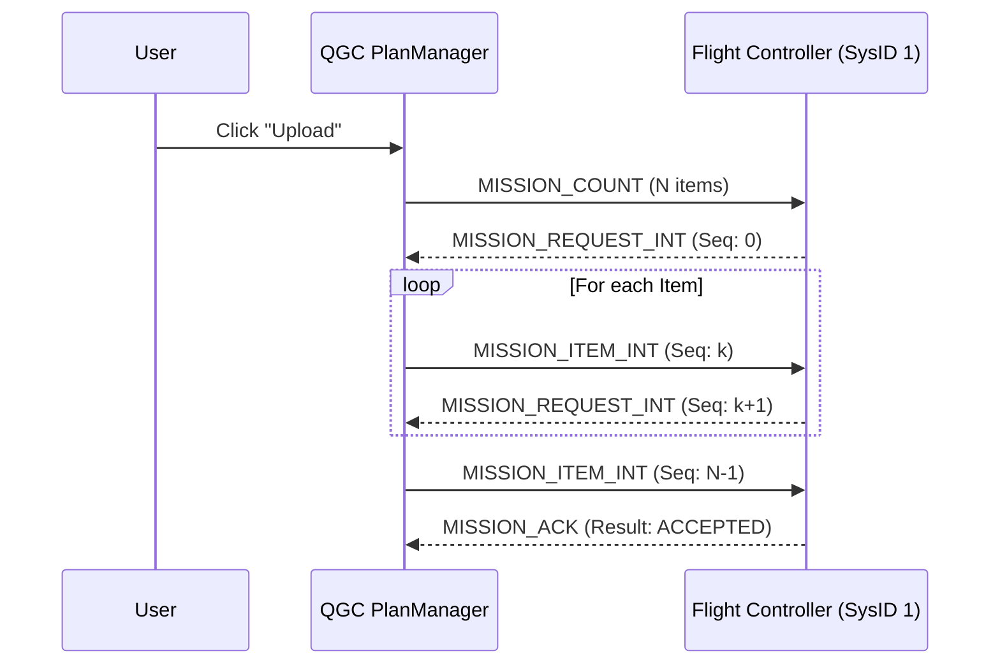

### 2. Start Mission (Standard)

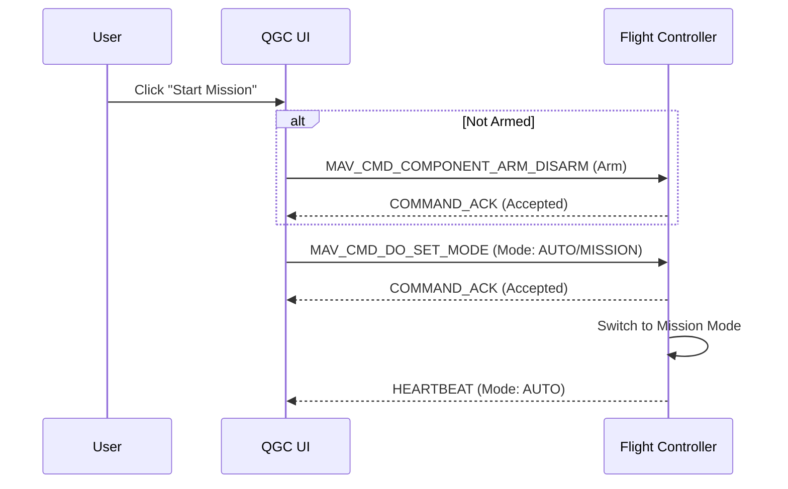

### 3. Pause / Resume (Standard)

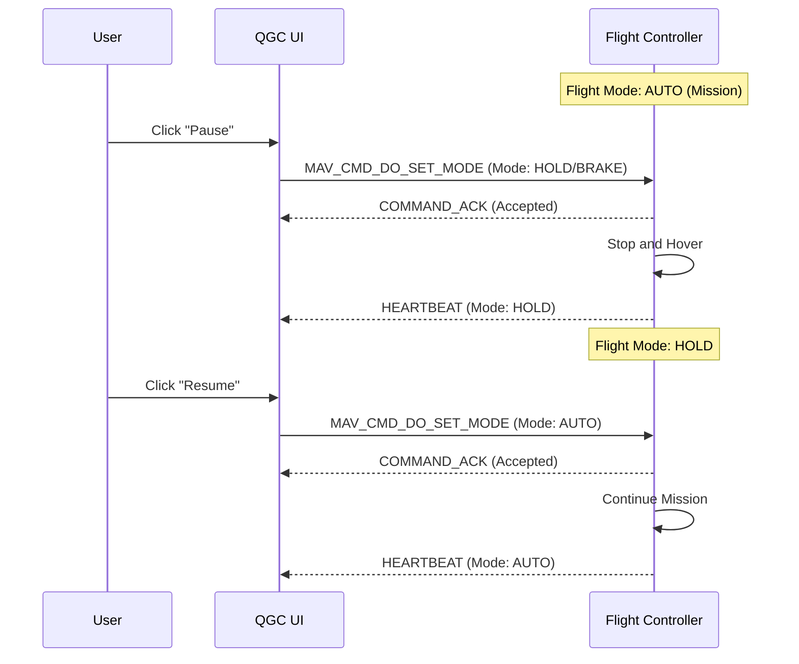

### 4. Takeoff (Standard)

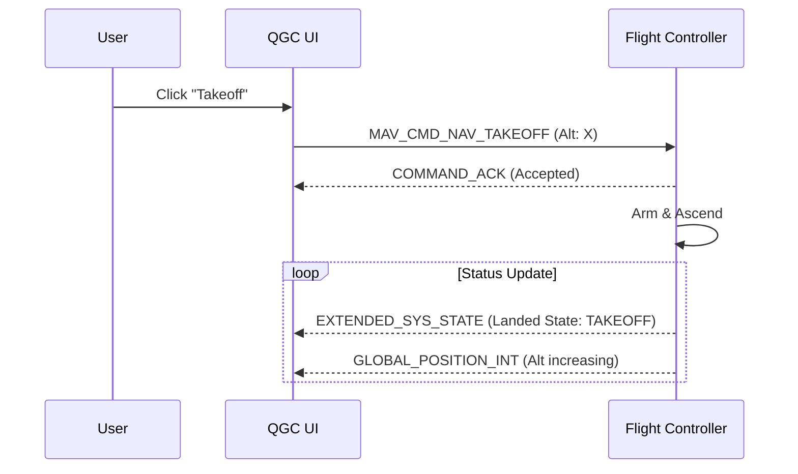

### 5. Mission Progress Tracking (Standard)

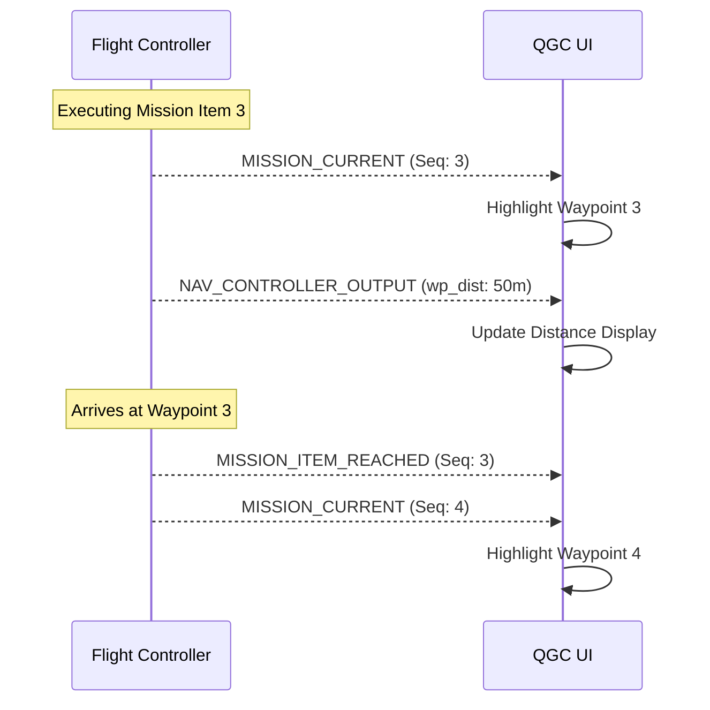

### 6. Set Maximum Speed (Standard)

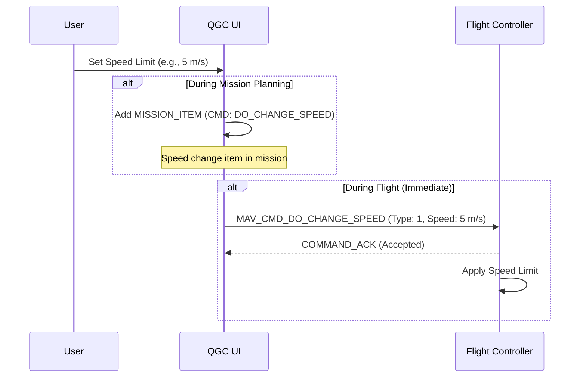

### 7. Change Altitude (Standard)

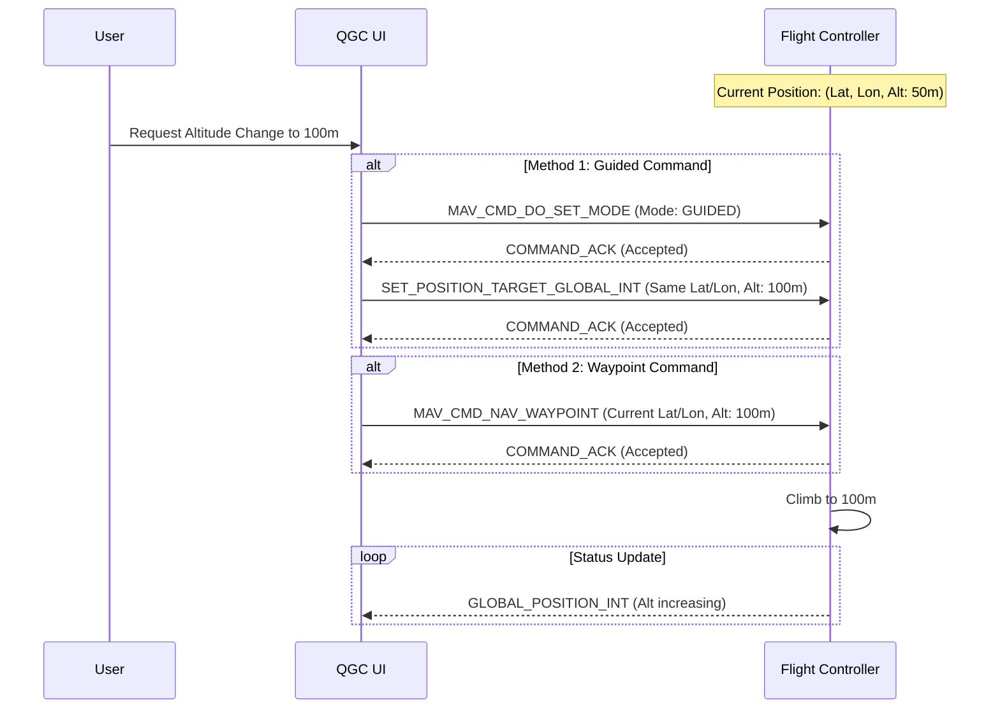

### 8. Go To Location (Standard)

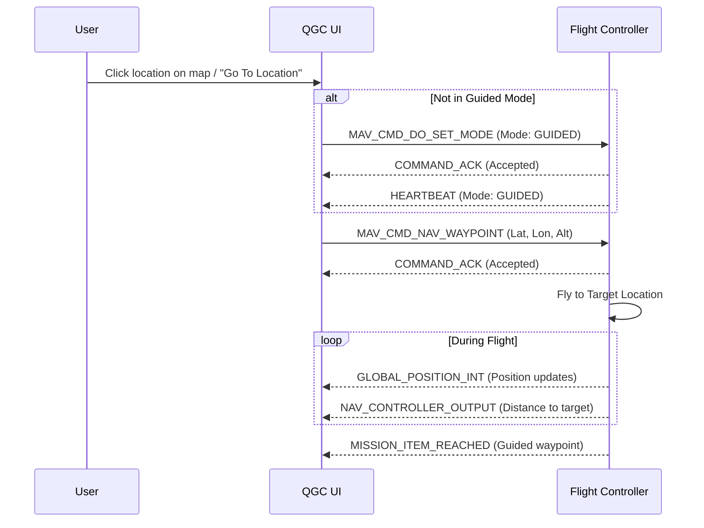

### 9. Go To Waypoint (Standard)

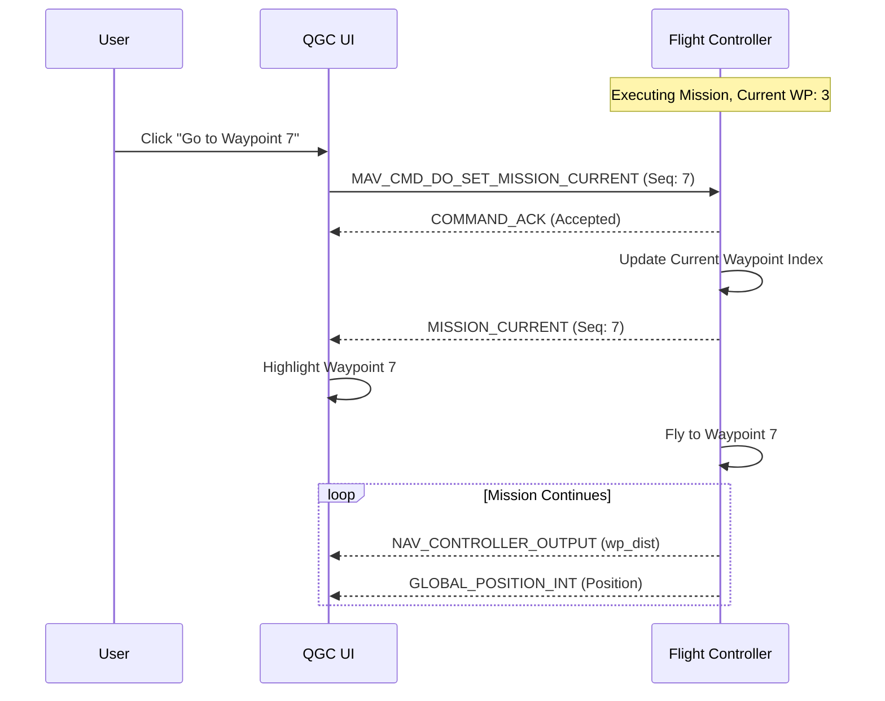

## Mission Interrupt and Resume Behavior

### Overview
When a mission is interrupted in standard QGC, the resume behavior depends on **how** the mission was interrupted and the **firmware configuration**. This can lead to inconsistent behavior where sometimes the vehicle returns to takeoff/home and sometimes it continues from the current position.

### Interrupt Scenarios

#### 1. Joystick Manual Takeover

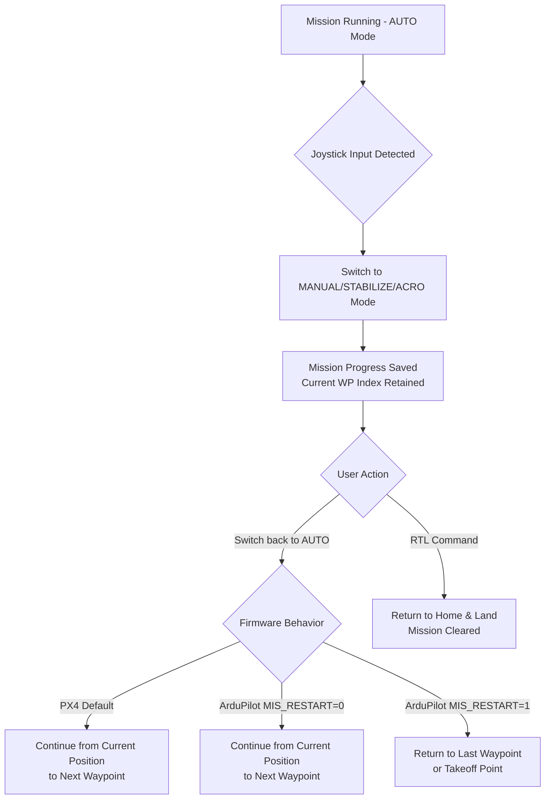

**Key Factors:**
*   **Mission State:** Current waypoint index is preserved in memory.
*   **PX4:** Typically continues from current position when switching back to AUTO.
*   **ArduPilot:** Depends on `MIS_RESTART` parameter:
    *   `MIS_RESTART = 0`: Resume from nearest point in mission.
    *   `MIS_RESTART = 1`: Restart from first waypoint or last achieved waypoint.
*   **User Control:** Pilot manually controls vehicle during manual mode.

#### 2. Pause Command

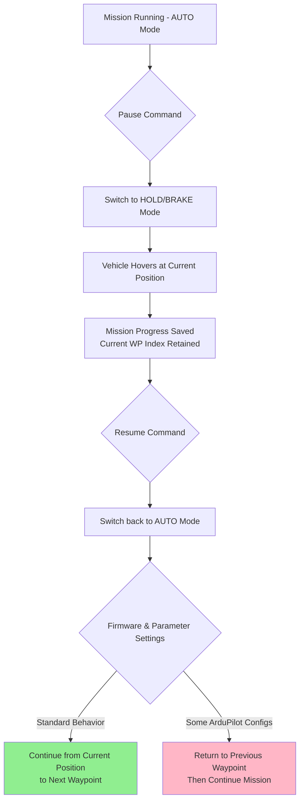

**Key Factors:**
*   **Position Hold:** Vehicle stays at pause location.
*   **Most Common:** Continues from current position to next waypoint.
*   **Exception Cases:** 
    *   If waypoint was already passed, behavior depends on `MIS_OPTIONS` (ArduPilot).
    *   Some safety configurations force return to last waypoint.

#### 3. Land Command During Mission

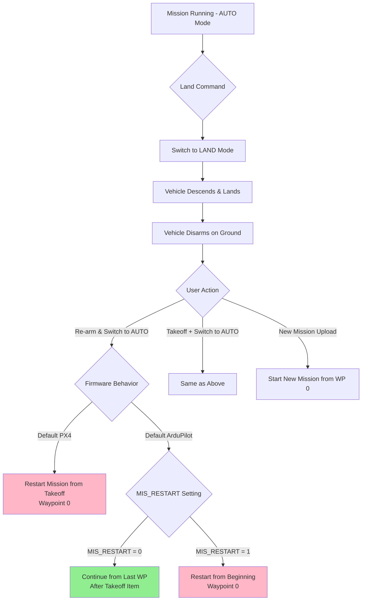

**Key Factors:**
*   **Disarm Event:** Landing typically disarms the vehicle, which can trigger mission reset logic.
*   **Most Common:** Mission restarts from beginning (returns to takeoff point).
*   **ArduPilot `MIS_RESTART`:** 
    *   `0`: May continue from last waypoint (after auto-takeoff).
    *   `1`: Always restart from first waypoint.
*   **PX4:** Usually restarts mission from waypoint 0 after disarm/rearm cycle.

### Comparison Table

| Interrupt Type | Vehicle State After | Current WP Preserved? | Resume Behavior (Typical) | Goes to Takeoff Point? |
|:---|:---|:---|:---|:---|
| **Joystick Takeover** | MANUAL/STABILIZE | ✅ Yes | Continue from current position | ❌ No (usually) |
| **Pause (HOLD)** | HOLD/BRAKE | ✅ Yes | Continue from current position | ❌ No |
| **Land Command** | LAND → DISARMED | ⚠️ Depends on firmware | Often restarts mission | ✅ Yes (often) |
| **RTL Command** | RTL → LAND | ❌ Mission cleared | Mission must be restarted | ✅ Yes (by definition) |
| **Battery Failsafe** | RTL/LAND | ❌ Mission cleared | Mission must be restarted | ✅ Yes |

### Configuration Parameters Affecting Resume Behavior

#### ArduPilot
*   **`MIS_RESTART`**: 
    *   `0` = Resume mission (continue from nearest point).
    *   `1` = Restart mission (go back to start/takeoff).
*   **`MIS_OPTIONS`**: Bitmask for mission behavior options.
    *   Bit 0: Clear mission on reboot.
    *   Bit 1: Use distance to WP for resume (not sequence).

#### PX4
*   **`MIS_TAKEOFF_ALT`**: Takeoff altitude for mission restart.
*   **`COM_RC_OVERRIDE`**: Mode switch behavior on RC input.
*   **Mission Resume Logic**: Generally continues from current mission item unless disarmed.

### Why Inconsistent Behavior Occurs

1. **Disarm Events**: Landing disarms vehicle → triggers mission reset in some firmware versions.
2. **Firmware Differences**: PX4 vs ArduPilot handle mission state differently.
3. **Parameter Configuration**: Users may have different `MIS_RESTART` settings.
4. **Safety Logic**: Some configurations prioritize returning to known safe waypoints.
5. **Mode Switches**: Different flight mode transitions have different state preservation rules.

### Best Practices for Predictable Resume

*   **For Pause/Resume**: Use HOLD/BRAKE modes (not LAND) - most predictable continuation.
*   **For Manual Control**: Switch back to AUTO quickly - preserves mission state.
*   **After Landing**: Expect mission restart; use "Go To Waypoint" command if needed.
*   **Check Parameters**: Verify `MIS_RESTART` and `MIS_OPTIONS` settings match desired behavior.
*   **Test Configuration**: Test interrupt/resume behavior with specific firmware before field operations.

## Comparison Points (Preview)

| Feature | Stock QGC | DroneLeaf Integration |
| :--- | :--- | :--- |
| **Mission Target** | Vehicle (SysID 1) | Leaf Manager (SysID 2) |
| **Start Mechanism** | Flight Mode Switch (`AUTO`) | Custom Message (`LEAF_QGC_MISSION_START`) |
| **Guided Mode** | `MAV_CMD_NAV_WAYPOINT` to Vehicle | `MAV_CMD_NAV_WAYPOINT` to Leaf Manager |
| **Pause/Resume** | Mode Switch (`HOLD`/`AUTO`) | `LEAF_CONTROL_CMD` (Pause/Resume) |
| **Takeoff** | `MAV_CMD_NAV_TAKEOFF` | (Likely) `LEAF_CONTROL_CMD` or `MAV_CMD_NAV_TAKEOFF` redirected |
| **Progress** | `MISSION_CURRENT` (Msg 42) | `LEAF_STATUS` / `LEAF_MISSION_STATUS` |
